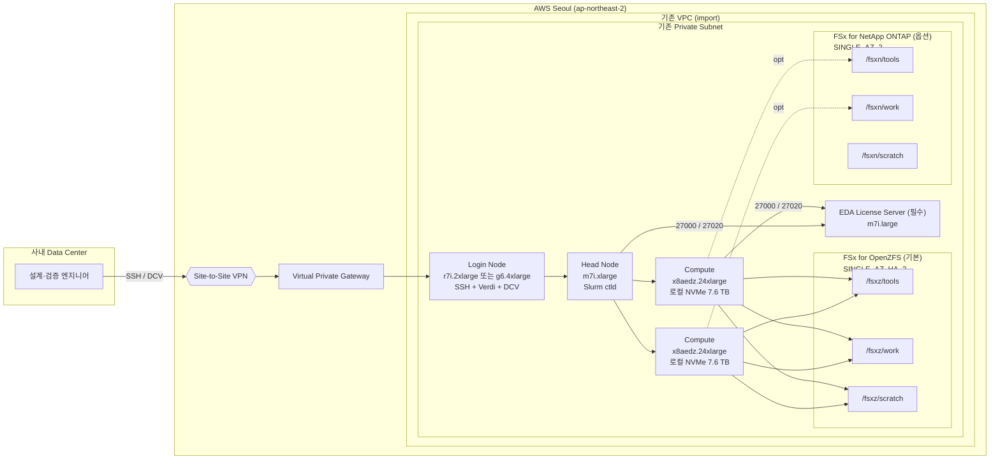
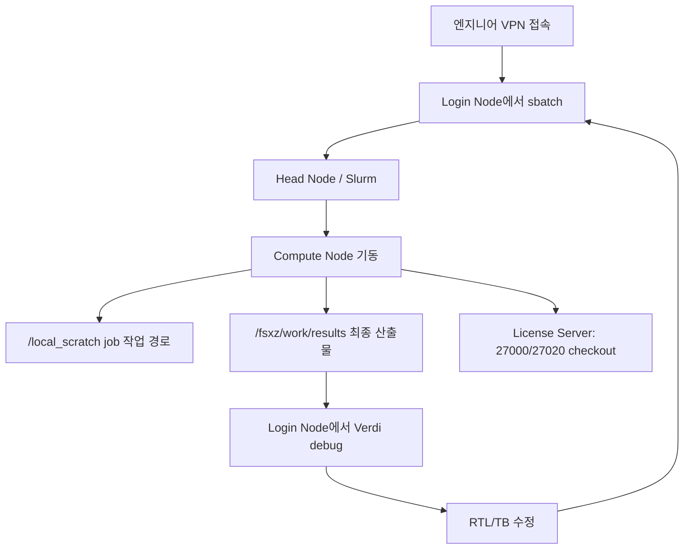

[English](./architecture_guide.md) | [한국어](./architecture_guide.ko.md)

# EDA on AWS — 아키텍처 가이드

AWS 서울 리전에서 EDA simulation/regression 환경을 운영하기 위한 AWS ParallelCluster + FSx 구성 문서입니다.

---

## 1. 전제

| 항목 | 값 |
|---|---|
| Region | ap-northeast-2 (Seoul) |
| 사내 Data Center ↔ AWS | Site-to-Site VPN (Virtual Private Gateway) |
| VPC / Subnet | 기존 자원 재사용 (CDK는 생성하지 않고 import) |
| 클러스터 배치 | Private subnet |
| 스케줄러 | Slurm |
| OS | RHEL 8.4+ |
| ParallelCluster | 3.15.x (3.15.1 검증) |

VPC CIDR과 사내망 CIDR은 겹치지 않도록 설계합니다. [R9]

---

## 2. 전체 아키텍처



사용자는 사내망에서 VPN을 통해 Login Node의 **private IP** 로 접속합니다. Login Node에서 job을 제출하면 Head Node의 Slurm이 Compute Node를 자동 프로비저닝합니다.

---

## 3. 노드 구성

| 역할 | 인스턴스 | 수량 | 용도 |
|---|---|---:|---|
| Head Node | `m7i.xlarge` | 1 | Slurm controller |
| Login Node | `r7i.2xlarge` / `g6.4xlarge` | 1 | 기본 `r7i.2xlarge`; DCV 활성화 시 `g6.4xlarge` |
| Compute | `x8aedz.24xlarge` | 0~2 | PowerArtist scratch, VCS simulation / regression (`MinCount=0`, `MaxCount=2`) |

총 용량: Compute 2대 기준 192 vCPU / 6 TiB memory / 로컬 NVMe 15.2 TB입니다.
설치 전 사전검사가 선택한 단일 subnet의 AZ에서 인스턴스 제공 여부를 확인합니다.
현재 서울 리전 제공 여부는 `ap-northeast-2a`에서 확인했습니다. [R15][R16][R17]

---

## 4. 스토리지

### 4.1 FSx for OpenZFS (기본 활성)

Day 1 기본 스토리지로 가장 단순하고 빠른 구성입니다.

| 항목 | 값 |
|---|---|
| Deployment type | `SINGLE_AZ_HA_2` (2세대, NVMe L2ARC 캐시) |
| Storage capacity | 32 TiB / 32,768 GiB (프로젝트 범위: 16~32 TiB) |
| Throughput | 7,680 MBps (최대 tier보다 한 단계 낮음) |
| SSD IOPS | 300,000, `USER_PROVISIONED` (해당 tier 최대 307,200 미만) |
| File server cache | 파일 서버 메모리와 관리형 NVMe L2ARC |
| Backup retention | 7 days |

**볼륨 구성**

| 볼륨 | Mount | Quota | Reservation | 압축 | 성격 |
|---|---|---:|---:|---|---|
| `fsxz_tools` | `/fsxz/tools` | 3,276 GiB | 655 GiB | ZSTD | EDA 툴 설치본·wrapper·env |
| `fsxz_work` | `/fsxz/work` | 13,107 GiB | 6,553 GiB | ZSTD | RTL·TB·results·coverage |
| `fsxz_scratch` | `/fsxz/scratch` | 13,107 GiB | 0 (thin) | LZ4 | 공유 job staging / 비로컬 임시 데이터 |

Quota와 reservation은 설정한 부모 용량에 따라 자동 계산됩니다. 위 값은 프로젝트
기본값인 32 TiB에서 생성되는 레이아웃입니다.

기본값 7,680 MBps / 300,000 IOPS는 최대 tier보다 한 단계 낮습니다. 다만 OpenZFS
quota는 리전 내 파일시스템 합계에 적용되므로, 기존 파일시스템 사용량을 포함해
throughput과 disk IOPS 여유를 확인해야 합니다. [R1S-1][R1S-2]

### 4.2 FSx for NetApp ONTAP (옵션)

FSx for ONTAP은 기본 비활성입니다. 중복 데이터가 많은 프로젝트의 저장 공간을
줄이거나, 파일 단위 복구를 위한 snapshot, 데이터 복제, NetApp 운영 기능이
필요할 때 OpenZFS를 대체하거나 함께 사용할 수 있습니다. ONTAP은 compression,
compaction, deduplication을 제공하며 AWS는 일반 파일 공유 워크로드에서 최대
65%의 절감 예시를 제시합니다. 실제 EDA 데이터의 절감률은 파일 형식과 중복도에
따라 달라지므로 CloudWatch의 `LogicalDataStored`와 `StorageUsed`로 측정해야
합니다. [R1S-6]

이 프로젝트는 ONTAP의 **NFS 공유 스토리지**만 ParallelCluster에 연결합니다.
ONTAP 자체는 SMB, iSCSI, NVMe/TCP, SnapMirror와 파일 접근 감사를 지원하지만,
이 기능들은 스택이 자동 구성하지 않으며 배포 후 별도 설계와 설정이 필요합니다.
[R1][R1S-9]

| 항목 | 값 |
|---|---|
| Deployment type | `SINGLE_AZ_2` (2세대) |
| 가용성 범위 | 단일 AZ 내부 active-standby HA, AZ 장애 보호는 제공하지 않음 |
| HA pairs | 1 (범위: 1~12, HA pair당 최대 6 GBps / 200K SSD IOPS) |
| Throughput per HA | 3,072 MBps (허용값: 1536 / 3072 / 6144) |
| SSD storage capacity | 10 TiB (범위: 1 TiB ~ 1 PiB, HA pair당 최대 512 TiB) |
| SSD IOPS | Automatic |
| Tiering | NONE (EDA hot data는 SSD 고정) |
| Storage efficiency | 각 데이터 볼륨에 활성화 |
| Snapshot policy | ONTAP `default` (시간당 6개, 일일 2개, 주간 2개 유지) |
| Automatic backup | 7일 보존 |
| 암호화 | 고객 관리형 KMS key로 저장 데이터 암호화 |

**이 프로젝트가 생성하는 구성**

- FSx for ONTAP 파일 시스템 1개와 Storage Virtual Machine `edasvm` 1개
- NFS용 FlexVol 볼륨 3개와 ParallelCluster의 `/fsxn/*` 자동 마운트
- 무작위 `fsxadmin` 암호를 저장하는 Secrets Manager secret
- Cluster Node 보안 그룹에서 필요한 ONTAP 포트만 허용하는 전용 보안 그룹
- 파일 시스템·SVM·볼륨 ID를 제공하는 CloudFormation output과 SSM parameter

**볼륨 구성**

| 볼륨 | Junction | Cluster mount | 논리 크기 | 용도 |
|---|---|---|---:|---|
| `fsxn_tools` | `/fsxn_tools` | `/fsxn/tools` | 1 TiB | EDA 툴·공용 환경 |
| `fsxn_work` | `/fsxn_work` | `/fsxn/work` | 4 TiB | 프로젝트·결과·릴리스 |
| `fsxn_scratch` | `/fsxn_scratch` | `/fsxn/scratch` | 4 TiB | 임시 작업 데이터 |

볼륨 크기 1/4/4 TiB는 현재 CDK에 고정된 **논리 크기**이며
`ONTAP_SIZE_GIB`에 따라 자동 조정되지 않습니다. ONTAP은 thin provisioning을
사용하지만, tiering을 비활성화했으므로 실제 데이터·metadata·snapshot 변경분은
프로비저닝한 SSD 용량 안에 있어야 합니다.

**운영 시 주의사항**

- `SINGLE_AZ_2`는 파일 서버 장애에는 자동 failover하지만 AZ 전체 장애를
  보호하지 않습니다. 별도 장애 복구가 필요하면 다른 파일 시스템으로
  SnapMirror 복제하거나 backup 복구 전략을 설계합니다. [R1S-5]
- ONTAP snapshot은 볼륨의 변경된 블록을 같은 SSD 용량에서 사용하며 automatic
  backup과 별개입니다. 쓰기 변경량이 많으면 snapshot 공간을 모니터링해야
  합니다. [R1S-8]
- SnapMirror, 파일 접근 감사, SMB/iSCSI/NVMe/TCP는 지원 기능일 뿐 이 프로젝트가
  자동 활성화하지 않습니다.
- `ENABLE_OPENZFS=1`과 `ENABLE_ONTAP=1`이면 두 파일 시스템을 모두 생성하여
  각각 과금됩니다. ONTAP만 사용할 경우 `ENABLE_OPENZFS=0`으로 설정합니다.
- 파일 시스템, SVM, 볼륨과 KMS key에는 `RETAIN` 정책이 적용됩니다. 스택을
  삭제해도 남아 비용이 발생할 수 있으므로 데이터 확인 후 별도로 정리합니다.

### 4.3 두 스토리지를 함께 쓰는 전략

ONTAP을 추가한 경우 다음과 같이 역할을 분리하는 것을 권장합니다.

| 경로 | 역할 |
|---|---|
| `/fsxz/*` | Hot working set (고속 working copy, simulation scratch) |
| `/fsxn/work/archive/` | Master 데이터, audit 대상 (SnapMirror 가능) |
| `/fsxn/work/releases/` | 릴리스 아티팩트 (efficiency 활용) |

---

## 5. EDA License 서버 (필수)

모든 배포는 AWS 내부에 전용 라이선스 서버를 생성합니다. 기본 운영 모델은
Synopsys SCL/FlexNet floating license이며, license checkout latency와
on-prem VPN 의존을 제거합니다.

### 5.1 구성

| 항목 | 값 |
|---|---|
| Instance type | `m7i.large` (변경 가능) |
| OS | RHEL 8 (Red Hat 공식 AMI) |
| Root EBS | 30 GiB gp3, KMS 암호화 |
| Network | Static ENI 선분리 → EC2 교체 시에도 MAC 주소 영속 |
| SSH Key | 전용 KeyPair (`eda-license-key-{account}`) |
| IAM | `AmazonSSMManagedInstanceCore`, `CloudWatchAgentServerPolicy` |
| 기본 라이선스 모델 | Synopsys SCL/FlexNet floating license |
| 기본 포트 | `lmgrd` TCP 27000, 고정 `snpslmd` TCP 27020 |

### 5.2 Security Group

| 방향 | 포트 | 소스 | 용도 |
|---|---|---|---|
| Ingress | TCP 22 | 0.0.0.0/0 | SSH (private subnet이라 VPN 경유만 도달 가능) |
| Ingress | TCP 27000 | `sg_cluster_nodes` | `lmgrd` manager 포트(변경 가능) |
| Ingress | TCP 27020 | `sg_cluster_nodes` | `snpslmd` vendor 포트(변경 가능) |

라이선스 파일에는 **반드시 vendor 포트를 고정**하여 SG 경계를 단순화합니다.

```
SERVER <hostname> <MAC> 27000
VENDOR snpslmd PORT=27020
USE_SERVER
```

### 5.3 초기 설치 절차

setup 스크립트가 SSH 키와 MAC 주소를 콘솔에 출력합니다. 운영자는 다음을 수동으로 수행합니다.

1. 출력된 MAC 주소를 EDA 툴 벤더에 제출 → 라이선스 파일 수령
2. SSH 접속 (VPN 경유):
   `ssh -i ~/.ssh/eda-license-key-<account>.pem ec2-user@<private-ip>`
3. 선택 사항: 벤더 문서가 32bit runtime을 요구하는 경우에만 관련 라이브러리 설치:
   ```
   sudo dnf -y install glibc.i686 libstdc++.i686 libX11.i686 \
       libXext.i686 libXrender.i686 libgcc.i686 ncurses-libs.i686 lsof
   ```
   이 명령은 AWS 스택 배포 필수조건이 아닙니다. 격리망에서 실행하려면 사용 가능한
   내부 RPM 저장소 또는 오프라인 패키지가 필요합니다.
4. Synopsys SCL 또는 선택한 벤더의 라이선스 매니저 바이너리 설치
5. 라이선스 파일 배치 (예: `/opt/eda/<vendor>/licenses/license.dat`)
6. 벤더 라이선스 데몬 기동
7. Cluster의 floating license 클라이언트에서 manager 서버 설정
   (기본 포트: 27000):
   ```bash
   export SNPSLMD_LICENSE_FILE=27000@<license-server-private-ip>
   # 범용 FlexNet 변수만 확인하는 툴이 있으면 함께 설정
   export LM_LICENSE_FILE="${SNPSLMD_LICENSE_FILE}"
   ```

`port@host`는 floating license 클라이언트가 `lmgrd`를 찾는 표준적인 서버
지정 방식입니다. 클라이언트는 먼저 manager 포트 27000에 연결하고 `lmgrd`의
안내를 받아 고정된 `snpslmd` 포트 27020으로 연결하므로, 환경변수에는 manager
포트만 지정하지만 SG에는 두 포트가 모두 필요합니다. `export`는 현재 shell에만
적용됩니다. 전체 Cluster에 영구 적용하려면 modulefile 또는
`/etc/profile.d/synopsys-license.sh`에 같은 값을 설정합니다.

### 5.4 다른 라이선스 벤더

다른 FlexNet 호환 벤더를 사용해도 EC2 라이선스 서버는 필수입니다.
`LICENSE_MANAGER_PORT`와 `LICENSE_VENDOR_PORT`를 해당 벤더 라이선스 파일에
고정한 포트와 동일하게 설정합니다. Cluster SG에서는 설정한 두 포트만 허용됩니다.

---

## 6. Slurm 설정

| 항목 | 값 |
|---|---|
| Queue 수 | 1 (`eda-x8aedz`) |
| Compute resource | `x8aedz.24xlarge`, `MinCount=0`, `MaxCount=2` |
| `EnableMemoryBasedScheduling` | `true` |
| `JobExclusiveAllocation` | `false` (작은 job 다수에 유리) |
| `ScaledownIdletime` | 15분 |
| Spot | 미사용 |

이 Day 1 구성에는 지속적인 Slurm job accounting용 RDS와 `slurmdbd`를
포함하지 않습니다. 따라서 `sacct` 기반의 이력 조회는 제공하지 않으며, 운영자는
job 출력 파일과 실행 중인 `squeue` 상태를 사용합니다. 장기간 사용 이력이나
부서별 사용량 분석이 필요해지면 별도 설계로 Slurm accounting을 추가합니다.

---

## 7. 네트워크 / 접속

### 7.1 Security Group

| SG | 주요 역할 |
|---|---|
| `sg_cluster_nodes` | Head / Login / Compute 공통 |
| `sg_fsx` | OpenZFS NFS (TCP/UDP 111, 2049, 20001-20003) ← `sg_cluster_nodes` |
| `sg_ontap` | ONTAP NFS + 관리 (TCP 22, 111, 443, 635, 2049, 3260, 4045, 4046, 4420, 4421) ← `sg_cluster_nodes` |
| `sg_license` | License server (TCP 27000, 27020) ← `sg_cluster_nodes`, TCP 22 ← 0.0.0.0/0 (private subnet, VPN 경유만 실도달) |

### 7.2 접속 정책

- 엔지니어는 사내망 → VPN → **Login Node private IP** 로 접속 [R11]
- `Ssh.AllowedIps` / `Dcv.AllowedIps` 를 사내 CIDR로 제한 [R31]
- Head Node는 `pcluster ssh` 명령으로만 접근

---

## 8. 디렉터리 정책

아래 구조와 운영 규칙은 EDA 워크로드를 위한 참고 예시입니다. 고객은 조직의
프로젝트 분류, 사용자·그룹 권한, 데이터 보존 및 백업 정책에 맞춰 디렉터리 구조와
권한 정책을 설계하여 사용해야 합니다.

### 8.1 예시 구조

```
/fsxz/tools/
  eda/
  wrappers/
  env/

/fsxz/work/
  projects/chipA/{rtl, tb, filelist, scripts, releases}/
  results/chipA/{nightly, release_qual}/
  coverage/chipA/

/fsxz/scratch/
  ${USER}/${SLURM_JOB_ID}/
```

### 8.2 운영 규칙

1. Simulation / regression은 **`/fsxz/scratch/$USER/$SLURM_JOB_ID`** 에서 실행
2. 최종 보존 대상만 `/fsxz/work/results` 또는 `/fsxn/work/archive` 로 승격
3. `/fsxz/tools` 변경은 플랫폼 관리자만 수행
4. `/home` 은 shell 설정·dotfile 용도; 프로젝트 데이터를 두지 않음

### 8.3 `/home` 정책

ParallelCluster 기본 동작(Head Node `/home` 공유)을 그대로 사용합니다. 사용자 수 증가 또는 AD 연동이 필요해지는 시점에 외부 스토리지로 직접 마운트하는 방식을 검토합니다.

---

## 9. 백업 / 스냅샷

| 대상 | 전략 |
|---|---|
| FSx OpenZFS | Automatic backup 7일, `/fsxz/work`·`/fsxz/tools` 는 릴리스·툴업 직전 user snapshot 수동 생성 |
| FSx ONTAP | Automatic backup 7일, default snapshot policy (시간당 6 / 일일 2 / 주간 2) |
| License 서버 | 별도 자동 스냅샷 없음. 라이선스 파일·SCL 바이너리는 S3에 별도 백업 |

---

## 10. 배포된 클러스터의 초기 구성 요약

아래 값은 이 프로젝트가 최초 배포할 때의 클러스터 구성 기준입니다. 운영 중
설정을 변경했다면 CloudFormation stack, ParallelCluster 설정 및 AWS Console에서
현재 값을 확인합니다.

### 클러스터

| 항목 | 값 |
|---|---|
| Region | ap-northeast-2 |
| ParallelCluster | 3.15.x (3.15.1 검증) |
| Scheduler | Slurm |
| OS | RHEL 8.4+ |
| Queue 수 | 1 |
| Spot | 미사용 |

### 노드

| 역할 | 인스턴스 | 수량 |
|---|---|---:|
| Head Node | `m7i.xlarge` | 1 |
| Login Node | `r7i.2xlarge` / `g6.4xlarge` | 1 |
| Compute | `x8aedz.24xlarge` | 0~2 |
| License Server (필수) | `m7i.large` | 1 |

### 스토리지

| 항목 | OpenZFS (기본) | ONTAP (옵션) |
|---|---|---|
| Deployment | `SINGLE_AZ_HA_2` | `SINGLE_AZ_2` |
| Capacity | 32 TiB | 10 TiB |
| Throughput / IOPS | 7,680 MBps / 300,000 | 3,072 MBps × 1 HA / Automatic |

---

## 11. 배포 옵션

### 11.1 설정 파일

모든 배포 옵션은 `config/default.env` 에 선언되어 있습니다. 설치 스크립트가 실행 시 자동으로 로드합니다.

```
config/
├── default.env     # 기본값 (프로젝트에 포함됨)
└── example.env     # 환경별 예시 — 복사해서 사용
```

**파일 내용 예시 (`config/default.env`)**:

```bash
REGION="ap-northeast-2"
CLUSTER_NAME="hpc-cluster"

VPC_ID=""          # 기존 VPC ID
SUBNET_ID=""       # 기존 private subnet ID

ENABLE_OPENZFS=1
OPENZFS_SIZE_GIB=32768
OPENZFS_THROUGHPUT=7680
OPENZFS_IOPS=300000

ENABLE_ONTAP=0
LICENSE_INSTANCE_TYPE="m7i.large"
LICENSE_MANAGER_PORT=27000
LICENSE_VENDOR_PORT=27020
ENABLE_VPC_ENDPOINTS=1
```

### 11.2 설정 우선순위

동일한 변수가 여러 곳에 있을 때 **위에서 아래 순**으로 우선 적용됩니다.

1. **Shell 환경변수** (`VPC_ID=xxx ./setup.sh`)
2. **CONFIG 파일** (`CONFIG=config/prod.env ./setup.sh` 또는 기본 `config/default.env`)
3. **스크립트 내부 fallback** (마지막 안전망)

### 11.3 전체 옵션

| 변수 | 기본값 | 설명 |
|---|---|---|
| `VPC_ID` | (필수) | 기존 VPC ID |
| `SUBNET_ID` | (필수) | Private subnet ID |
| `REGION` | `ap-northeast-2` | AWS 리전 |
| `CLUSTER_NAME` | `hpc-cluster` | ParallelCluster 이름 |
| `ENABLE_OPENZFS` | `1` | FSx OpenZFS 생성 여부 |
| `OPENZFS_SIZE_GIB` | `32768` | OpenZFS 용량 (프로젝트 범위: 16,384 ~ 32,768 / 16~32 TiB) |
| `OPENZFS_THROUGHPUT` | `7680` | OpenZFS throughput (9개 허용값) |
| `OPENZFS_IOPS` | `300000` | 사용자 지정 IOPS. 최소 3 IOPS/GiB, 파일 서버 tier 및 리전 한도 이하 |
| `ENABLE_ONTAP` | `0` | FSx ONTAP 생성 여부 |
| `ONTAP_SIZE_GIB` | `10240` | ONTAP 용량 (1,024 ~ 1,048,576) |
| `ONTAP_TPUT_PER_HA` | `3072` | HA pair당 throughput (1536 / 3072 / 6144) |
| `ONTAP_HA_PAIRS` | `1` | HA pair 수 (1 ~ 12) |
| `LICENSE_INSTANCE_TYPE` | `m7i.large` | 라이선스 서버 인스턴스 타입 |
| `LICENSE_MANAGER_PORT` | `27000` | Manager 포트(기본 `lmgrd`) |
| `LICENSE_VENDOR_PORT` | `27020` | 고정 vendor daemon 포트(기본 `snpslmd`) |
| `ENABLE_SSM` | `0` | SSM Session Manager 활성화 |
| `ENABLE_VPC_ENDPOINTS` | `1` | 필수 VPC Endpoint 자동 생성 |

### 11.4 사용 예시

```bash
# 1) 기본 설정 파일로 실행
# config/default.env 의 VPC_ID/SUBNET_ID 를 먼저 채워둔 뒤:
./setup.sh

# 2) 환경별 설정 파일
cp config/example.env config/prod.env
$EDITOR config/prod.env
CONFIG=config/prod.env ./setup.sh

# 3) 개별 값 env override (config 파일 유지, 몇 개만 바꾸기)
VPC_ID=vpc-xxx SUBNET_ID=subnet-yyy ./setup.sh

# 4) 풀 구성 env override (ONTAP 2 HA + license server)
VPC_ID=vpc-xxx SUBNET_ID=subnet-yyy \
  ENABLE_OPENZFS=1 OPENZFS_THROUGHPUT=7680 OPENZFS_IOPS=300000 \
  ENABLE_ONTAP=1 ONTAP_HA_PAIRS=2 ONTAP_TPUT_PER_HA=6144 ONTAP_SIZE_GIB=20480 \
  ./setup.sh

```

---

## 12. 운영 흐름



**핵심 원칙**

- 실행은 Compute Node
- 분석은 Login Node (Verdi / DCV)
- 영구 보관은 `/fsxz/work` (또는 `/fsxn/work/archive`)
- PowerArtist 등 높은 I/O 임시 데이터는 `/local_scratch/$SLURM_JOB_ID`
- `/local_scratch`는 Compute Node 로컬 NVMe이며 노드 종료 시 삭제됨
- `/fsxz/scratch`는 공유 staging 공간이며 영구 프로젝트 저장소가 아님
- `/home` 은 프로젝트 저장소가 아님

---

## 13. 확장 시나리오

| 시기 | 증상 | 대응 |
|---|---|---|
| Compute 병목 | `x8aedz` 활용률 포화 / 작은 job 증가 | `c7i` queue 추가, queue 분리 |
| Login Node 병목 | Verdi 동시 사용자 2명 이상, 64 GiB 부족 | Verdi 전용 EC2 분리, Login pool count 증가 |
| Storage efficiency 요구 | 저장 비용 증가, audit 필요 | ONTAP 활성화 (storage efficiency, 파일 단위 감사) |
| License 용량 | 라이선스 매니저 throughput 한계 | instance type 승격, triad redundancy |
| 다중 cluster | 여러 cluster가 license 공유 | 중앙 라이선스 서버 |

---

## 14. 비용 개요

월 비용은 EC2, FSx, VPC Endpoint, 로그, 백업, 데이터 전송 사용량과 서울 리전의
현재 단가에 따라 달라지므로 고정 금액으로 단정하지 않습니다.

| 비용 구분 | 기본 리소스 |
|---|---|
| 상시 실행 | Head Node, Login Node, 필수 License Server, FSx OpenZFS 32 TiB / 7,680 MBps / 300,000 IOPS, Interface VPC Endpoint |
| 사용량 기반 | `x8aedz.24xlarge` Compute Node(`MinCount=0`, `MaxCount=2`), 백업, 로그, 데이터 전송 |
| 선택 | FSx for ONTAP, SSM Interface Endpoint |

승인 직전에 [AWS Pricing Calculator](https://calculator.aws/)에서
`ap-northeast-2` 기준 견적을 생성합니다. EDA 소프트웨어 및 floating license
비용은 AWS 인프라 비용에 포함되지 않습니다.

---

## 15. Day 1 에 포함하지 않은 요소

초기 구축 단순성을 위해 다음 항목은 명시적으로 제외했습니다. 실제 병목을 관찰한 뒤에 도입을 검토합니다.

- Spot queue
- 다중 queue (`compile`, `smoke`, `regression` 분리)
- Verdi 전용 EC2
- Custom AMI
- ONTAP block protocol (iSCSI / NVMe-oF)
- FSx 교차 리전 복제 (SnapMirror)
- 라이선스 서버 triad redundancy

---

## 16. 참고 문서

### AWS ParallelCluster
- [R1] FSx ONTAP / OpenZFS / File Cache shared storage — <https://docs.aws.amazon.com/parallelcluster/latest/ug/shared-storage-config-ontap-zfs-v3.html>
- [R4] Support policy — <https://docs.aws.amazon.com/parallelcluster/latest/ug/support-policy.html>
- [R5] Operating systems — <https://docs.aws.amazon.com/parallelcluster/latest/ug/operating-systems-v3.html>
- [R11] Login nodes — <https://docs.aws.amazon.com/parallelcluster/latest/ug/login-nodes-v3.html>
- [R13] DCV access — <https://docs.aws.amazon.com/parallelcluster/latest/ug/dcv-v3.html>
- [R14] Single-subnet / no-internet prerequisites — <https://docs.aws.amazon.com/parallelcluster/latest/ug/aws-parallelcluster-in-a-single-public-subnet-no-internet-v3.html>
- [R25] Internal directories — <https://docs.aws.amazon.com/parallelcluster/latest/ug/directories-v3.html>
- [R26] Scheduling (`JobExclusiveAllocation`) — <https://docs.aws.amazon.com/parallelcluster/latest/ug/Scheduling-v3.html>
- [R27] Slurm memory-based scheduling — <https://docs.aws.amazon.com/parallelcluster/latest/ug/slurm-mem-based-scheduling-v3.html>
- [R31] LoginNodes section / DCV AllowedIps — <https://docs.aws.amazon.com/parallelcluster/latest/ug/LoginNodes-v3.html>

### EDA 툴 벤더 문서
- [R6] Supported Platforms Guide Y-Foundation — <https://www.synopsys.com/support/licensing-installation-computeplatforms/compute-platforms/release-specific-support/supported-y-foundation.html>
- [R28] SCL Supported OS — <https://www.synopsys.com/support/licensing-installation-computeplatforms/licensing/scl-supported-os.html>

### Amazon EC2
- [R15] M7i instance — <https://aws.amazon.com/ec2/instance-types/m7i/>
- [R16] R7i instance — <https://aws.amazon.com/ec2/instance-types/memory-optimized/>
- [R17] R8i instance — <https://aws.amazon.com/ec2/instance-types/r8i>

### AWS Site-to-Site VPN
- [R9] Overview — <https://docs.aws.amazon.com/vpn/latest/s2svpn/VPC_VPN.html>
- [R10] How it works — <https://docs.aws.amazon.com/vpn/latest/s2svpn/how_it_works.html>

### FSx for OpenZFS
- [R1S-1] `CreateFileSystemOpenZFSConfiguration` API — <https://docs.aws.amazon.com/fsx/latest/APIReference/API_CreateFileSystemOpenZFSConfiguration.html>
- [R1S-2] Performance / NVMe L2ARC — <https://docs.aws.amazon.com/fsx/latest/OpenZFSGuide/performance-ssd.html>
- [R1S-3] Deployment types per region — <https://docs.aws.amazon.com/fsx/latest/OpenZFSGuide/availability-durability.html>
- [R21] Performance guidance — <https://docs.aws.amazon.com/fsx/latest/OpenZFSGuide/performance.html>
- [R24] Updating a volume — <https://docs.aws.amazon.com/fsx/latest/OpenZFSGuide/updating-volumes.html>
- [R34] Snapshots — <https://docs.aws.amazon.com/fsx/latest/OpenZFSGuide/snapshots-openzfs.html>

### FSx for NetApp ONTAP
- [R1S-4] `CreateFileSystemOntapConfiguration` API — <https://docs.aws.amazon.com/fsx/latest/APIReference/API_CreateFileSystemOntapConfiguration.html>
- [R1S-5] HA pairs — <https://docs.aws.amazon.com/fsx/latest/ONTAPGuide/HA-pairs.html>
- [R1S-6] Storage capacity / efficiency — <https://docs.aws.amazon.com/fsx/latest/ONTAPGuide/managing-storage-capacity.html>
- [R1S-7] Security groups / port requirements — <https://docs.aws.amazon.com/fsx/latest/ONTAPGuide/limit-access-security-groups.html>
- [R1S-8] Snapshots — <https://docs.aws.amazon.com/fsx/latest/ONTAPGuide/snapshots-ontap.html>
- [R1S-9] FSx for ONTAP overview / protocols / SnapMirror — <https://docs.aws.amazon.com/fsx/latest/ONTAPGuide/what-is-fsx-ontap.html>

### Slurm
- [R29] Licenses Guide — <https://slurm.schedmd.com/licenses.html>
