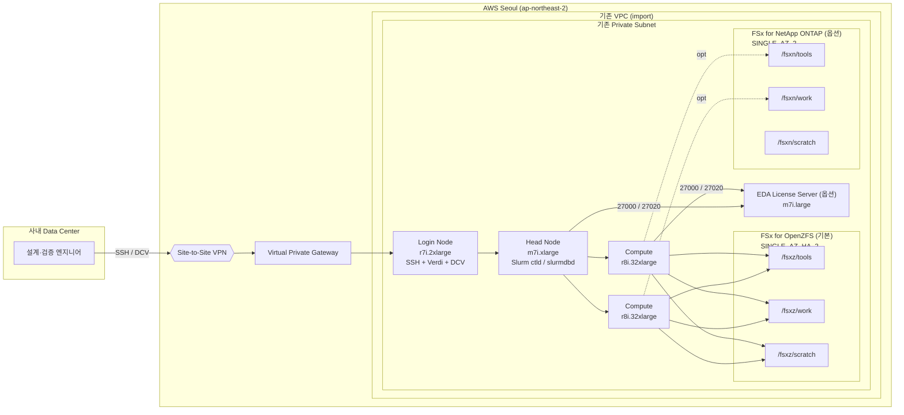

# EDA on AWS — 아키텍처 가이드

AWS 서울 리전에서 EDA simulation/regression 환경을 운영하기 위한 AWS ParallelCluster + FSx 구성 문서입니다.

---

## 1. 전제

| 항목 | 값 |
|---|---|
| Region | ap-northeast-2 (Seoul) |
| 사내 Data Center ↔ AWS | Site-to-Site VPN (Virtual Private Gateway) |
| VPC / Subnet | 기존 자원 재사용 (CDK는 생성하지 않고 import) |
| 클러스터 배치 | Private subnet |
| 스케줄러 | Slurm |
| OS | RHEL 8.4+ |
| ParallelCluster | 3.14.x |

VPC CIDR과 사내망 CIDR은 겹치지 않도록 설계합니다. [R9]

---

## 2. 전체 아키텍처



사용자는 사내망에서 VPN을 통해 Login Node의 **private IP** 로 접속합니다. Login Node에서 job을 제출하면 Head Node의 Slurm이 Compute Node를 자동 프로비저닝합니다.

---

## 3. 노드 구성

| 역할 | 인스턴스 | 수량 | 용도 |
|---|---|---:|---|
| Head Node | `m7i.xlarge` | 1 | Slurm controller, slurmdbd |
| Login Node | `r7i.2xlarge` | 1 | SSH, Verdi GUI, Amazon DCV |
| Compute | `r8i.32xlarge` | 0~2 | VCS simulation / regression (`MinCount=0`, `MaxCount=2`) |

총 용량: Compute 2대 기준 256 vCPU / 2 TiB memory. [R15][R16][R17]

---

## 4. 스토리지

### 4.1 FSx for OpenZFS (기본 활성)

Day 1 기본 스토리지로 가장 단순하고 빠른 구성입니다.

| 항목 | 값 |
|---|---|
| Deployment type | `SINGLE_AZ_HA_2` (2세대, NVMe L2ARC 캐시) |
| Storage capacity | 10 TiB (범위: 64 GiB ~ 512 TiB) |
| Throughput | 2,560 MBps (허용값: 160 / 320 / 640 / 1280 / 2560 / 3840 / 5120 / 7680 / 10240) |
| SSD IOPS | Automatic (3 IOPS/GiB) |
| Backup retention | 7 days |

**볼륨 구성**

| 볼륨 | Mount | Quota | Reservation | 압축 | 성격 |
|---|---|---:|---:|---|---|
| `fsxz_tools` | `/fsxz/tools` | 1 TiB | 256 GiB | ZSTD | EDA 툴 설치본·wrapper·env |
| `fsxz_work` | `/fsxz/work` | 4 TiB | 2 TiB | ZSTD | RTL·TB·results·coverage |
| `fsxz_scratch` | `/fsxz/scratch` | 4 TiB | 0 (thin) | LZ4 | job workdir |

### 4.2 FSx for NetApp ONTAP (옵션)

Storage efficiency(65-75% 절감), snapshot·SnapMirror, 파일 단위 감사가 필요한 경우 추가로 생성할 수 있습니다.

| 항목 | 값 |
|---|---|
| Deployment type | `SINGLE_AZ_2` (2세대) |
| HA pairs | 1 (범위: 1~12, HA pair당 6 GBps / 200K IOPS) |
| Throughput per HA | 3,072 MBps (허용값: 1536 / 3072 / 6144) |
| Storage capacity | 10 TiB (범위: 1 TiB ~ 1 PiB) |
| Tiering | NONE (EDA hot data는 SSD 고정) |
| Backup retention | 7 days |

**볼륨 구성 (SVM: `edasvm`)**

| 볼륨 | Junction | Mount | Size |
|---|---|---|---:|
| `fsxn_tools` | `/fsxn_tools` | `/fsxn/tools` | 1 TiB |
| `fsxn_work` | `/fsxn_work` | `/fsxn/work` | 4 TiB |
| `fsxn_scratch` | `/fsxn_scratch` | `/fsxn/scratch` | 4 TiB |

### 4.3 두 스토리지를 함께 쓰는 전략

ONTAP을 추가한 경우 다음과 같이 역할을 분리하는 것을 권장합니다.

| 경로 | 역할 |
|---|---|
| `/fsxz/*` | Hot working set (고속 working copy, simulation scratch) |
| `/fsxn/work/archive/` | Master 데이터, audit 대상 (SnapMirror 가능) |
| `/fsxn/work/releases/` | 릴리스 아티팩트 (efficiency 활용) |

---

## 5. EDA License 서버 (옵션)

AWS 내에 라이선스 서버를 두면 VPN latency(10~30ms)를 피하고 on-prem VPN 의존을 제거할 수 있습니다.

### 5.1 구성

| 항목 | 값 |
|---|---|
| Instance type | `m7i.large` (변경 가능) |
| OS | RHEL 8 (Red Hat 공식 AMI) |
| Root EBS | 30 GiB gp3, KMS 암호화 |
| Network | Static ENI 선분리 → EC2 교체 시에도 MAC 주소 영속 |
| SSH Key | 전용 KeyPair (`eda-license-key-{account}`) |
| IAM | `AmazonSSMManagedInstanceCore`, `CloudWatchAgentServerPolicy` |

### 5.2 Security Group

| 방향 | 포트 | 소스 | 용도 |
|---|---|---|---|
| Ingress | TCP 22 | 0.0.0.0/0 | SSH (private subnet이라 VPN 경유만 도달 가능) |
| Ingress | TCP 27000 | `sg_cluster_nodes` | License manager main port |
| Ingress | TCP 27020 | `sg_cluster_nodes` | License vendor daemon port |

라이선스 파일에는 **반드시 vendor 포트를 고정**하여 SG 경계를 단순화합니다.

```
SERVER <hostname> <MAC> 27000
VENDOR <vendor_daemon> PORT=27020
USE_SERVER
```

### 5.3 초기 설치 절차

setup 스크립트가 SSH 키와 MAC 주소를 콘솔에 출력합니다. 운영자는 다음을 수동으로 수행합니다.

1. 출력된 MAC 주소를 EDA 툴 벤더에 제출 → 라이선스 파일 수령
2. SSH 접속 (VPN 경유):
   `ssh -i ~/.ssh/eda-license-key-<account>.pem ec2-user@<private-ip>`
3. 32bit 라이브러리 설치:
   ```
   sudo dnf -y install glibc.i686 libstdc++.i686 libX11.i686 \
       libXext.i686 libXrender.i686 libgcc.i686 ncurses-libs.i686 lsof
   ```
4. 벤더 라이선스 매니저 바이너리 설치 (예: `/opt/eda/<vendor>/...`)
5. 라이선스 파일 배치 (예: `/opt/eda/<vendor>/licenses/license.dat`)
6. 벤더 라이선스 데몬 기동
7. Cluster에서 `export LM_LICENSE_FILE=27000@<private-ip>` 설정

### 5.4 On-prem 서버 재사용

기존 on-prem 라이선스 서버를 그대로 쓰는 경우 이 옵션을 비활성화합니다. 라이선스 재발급 불필요, 비용 없음. 단 VPN 터널 의존 + latency 발생.

---

## 6. Slurm 설정

| 항목 | 값 |
|---|---|
| Queue 수 | 1 (`eda-r8i`) |
| Compute resource | `r8i.32xlarge`, `MinCount=0`, `MaxCount=2` |
| `EnableMemoryBasedScheduling` | `true` |
| `JobExclusiveAllocation` | `false` (작은 job 다수에 유리) |
| `ScaledownIdletime` | 15분 |
| Spot | 미사용 |

### License resource

Slurm에 라이선스를 local resource로 등록하여 cluster 내 oversubscription을 1차 방어합니다. 외부 라이선스 서버와 자동 연동되지는 않지만 운영상 유용합니다. [R29]

```
Licenses=snps_vcs:40,snps_verdi:2
```

job 제출 시: `sbatch --licenses=snps_vcs:1 ...`

### Accounting

Head Node에 `slurmdbd` 를 두고 RDS MySQL(또는 Aurora MySQL)에 기록합니다. 누가·언제·얼마나 job을 돌렸는지 `sacct` 로 추적 가능합니다. [R30]

---

## 7. 네트워크 / 접속

### 7.1 Subnet 연결성 요구사항

ParallelCluster 부트스트랩에 필요한 AWS API:
CloudFormation, EC2, Auto Scaling, ELB, CloudWatch Logs, SSM, S3, DynamoDB.

Private subnet이 다음 중 하나를 만족해야 합니다.

- 옵션 A: `0.0.0.0/0` → NAT Gateway 또는 Transit Gateway
- 옵션 B: 위 서비스의 VPC Endpoint(Interface + Gateway) 전부 존재

설치 스크립트는 배포 전 이 상태를 확인하고, 둘 다 없으면 에러로 중단합니다.

### 7.2 Security Group

| SG | 주요 역할 |
|---|---|
| `sg_cluster_nodes` | Head / Login / Compute 공통 |
| `sg_fsx` | OpenZFS NFS (TCP/UDP 111, 2049, 20001-20003) ← `sg_cluster_nodes` |
| `sg_ontap` | ONTAP NFS + 관리 (TCP 22, 111, 443, 635, 2049, 3260, 4045, 4046, 4420, 4421) ← `sg_cluster_nodes` |
| `sg_license` | License server (TCP 27000, 27020) ← `sg_cluster_nodes`, TCP 22 ← 0.0.0.0/0 (private subnet, VPN 경유만 실도달) |

### 7.3 접속 정책

- 엔지니어는 사내망 → VPN → **Login Node private IP** 로 접속 [R11]
- `Ssh.AllowedIps` / `Dcv.AllowedIps` 를 사내 CIDR로 제한 [R31]
- Head Node는 `pcluster ssh` 명령으로만 접근

---

## 8. NFS mount

**OpenZFS export 기본값**: `rw,crossmnt,sync`. client 범위는 VPC CIDR로 제한하며 `*` 와 `no_root_squash` 는 사용하지 않습니다. [R24]

**Linux mount 권장값**: [R21]
```
nfsvers=3,nconnect=16,rsize=1048576,wsize=1048576,timeo=600,_netdev
```

특정 툴이 NFS v4.1 파일 locking을 요구할 경우 해당 볼륨만 v4.1로 재구성합니다.

---

## 9. 디렉터리 정책

### 9.1 기본 구조

```
/fsxz/tools/
  eda/
  wrappers/
  env/

/fsxz/work/
  projects/chipA/{rtl, tb, filelist, scripts, releases}/
  results/chipA/{nightly, release_qual}/
  coverage/chipA/

/fsxz/scratch/
  ${USER}/${SLURM_JOB_ID}/
```

### 9.2 운영 규칙

1. Simulation / regression은 **`/fsxz/scratch/$USER/$SLURM_JOB_ID`** 에서 실행
2. 최종 보존 대상만 `/fsxz/work/results` 또는 `/fsxn/work/archive` 로 승격
3. `/fsxz/tools` 변경은 플랫폼 관리자만 수행
4. `/home` 은 shell 설정·dotfile 용도; 프로젝트 데이터를 두지 않음

### 9.3 `/home` 정책

ParallelCluster 기본 동작(Head Node `/home` 공유)을 그대로 사용합니다. 사용자 수 증가 또는 AD 연동이 필요해지는 시점에 외부 스토리지로 직접 마운트하는 방식을 검토합니다.

---

## 10. 백업 / 스냅샷

| 대상 | 전략 |
|---|---|
| FSx OpenZFS | Automatic backup 7일, `/fsxz/work`·`/fsxz/tools` 는 릴리스·툴업 직전 user snapshot 수동 생성 |
| FSx ONTAP | Automatic backup 7일, default snapshot policy (시간당 6 / 일일 2 / 주간 2) |
| License 서버 | 별도 자동 스냅샷 없음. 라이선스 파일·SCL 바이너리는 S3에 별도 백업 |

---

## 11. Login Node 사용 여부 선택

Login Node는 기본 활성(`Count=1`)이며 EDA 팀 관행상 전용 submission host를 두는 것이 권장됩니다. 다음 경우에만 비활성화를 검토합니다.

- 엔지니어가 on-prem Linux 워크스테이션을 보유하고 Slurm 경험이 충분한 경우
- CI/CD 파이프라인에서 job을 제출하는 경우

비활성 시 on-prem 클라이언트가 갖춰야 할 요건:

1. Head Node와 **동일한 Slurm 버전**
2. `/etc/slurm/slurm.conf` 동기화
3. `/etc/munge/munge.key` 복사 + `munge` 데몬 기동
4. Cluster user 계정과 **UID/GID 일치**
5. `sg_cluster_nodes` 에 TCP 6817 (slurmctld) 허용 규칙 추가

Login Node를 유지할 때의 장점:

- Verdi GUI / DCV 즉시 사용
- 환경(OS·컴파일러·툴) 일관성 보장
- 디버깅·재현 용이

---

## 12. 초기값 요약

### 클러스터

| 항목 | 값 |
|---|---|
| Region | ap-northeast-2 |
| ParallelCluster | 3.14.x |
| Scheduler | Slurm |
| OS | RHEL 8.4+ |
| Queue 수 | 1 |
| Spot | 미사용 |

### 노드

| 역할 | 인스턴스 | 수량 |
|---|---|---:|
| Head Node | `m7i.xlarge` | 1 |
| Login Node | `r7i.2xlarge` | 1 |
| Compute | `r8i.32xlarge` | 0~2 |
| License Server (옵션) | `m7i.large` | 1 |

### 스토리지

| 항목 | OpenZFS (기본) | ONTAP (옵션) |
|---|---|---|
| Deployment | `SINGLE_AZ_HA_2` | `SINGLE_AZ_2` |
| Capacity | 10 TiB | 10 TiB |
| Throughput | 2,560 MBps | 3,072 MBps × 1 HA |

---

## 13. 배포 옵션

### 13.1 설정 파일

모든 배포 옵션은 `config/default.env` 에 선언되어 있습니다. 설치 스크립트가 실행 시 자동으로 로드합니다.

```
config/
├── default.env     # 기본값 (프로젝트에 포함됨)
└── example.env     # 환경별 예시 — 복사해서 사용
```

**파일 내용 예시 (`config/default.env`)**:

```bash
REGION="ap-northeast-2"
CLUSTER_NAME="hpc-cluster"

VPC_ID=""          # 기존 VPC ID
SUBNET_ID=""       # 기존 private subnet ID

ENABLE_OPENZFS=1
OPENZFS_SIZE_GIB=10240
OPENZFS_THROUGHPUT=2560

ENABLE_ONTAP=0
ENABLE_LICENSE_SERVER=1
ENABLE_LOGIN_NODE=1
ENABLE_VPC_ENDPOINTS=1
```

### 13.2 설정 우선순위

동일한 변수가 여러 곳에 있을 때 **위에서 아래 순**으로 우선 적용됩니다.

1. **Shell 환경변수** (`VPC_ID=xxx ./setup.sh`)
2. **CONFIG 파일** (`CONFIG=config/prod.env ./setup.sh` 또는 기본 `config/default.env`)
3. **스크립트 내부 fallback** (마지막 안전망)

### 13.3 전체 옵션

| 변수 | 기본값 | 설명 |
|---|---|---|
| `VPC_ID` | (필수) | 기존 VPC ID |
| `SUBNET_ID` | (필수) | Private subnet ID |
| `REGION` | `ap-northeast-2` | AWS 리전 |
| `CLUSTER_NAME` | `hpc-cluster` | ParallelCluster 이름 |
| `ENABLE_OPENZFS` | `1` | FSx OpenZFS 생성 여부 |
| `OPENZFS_SIZE_GIB` | `10240` | OpenZFS 용량 (64 ~ 524,288) |
| `OPENZFS_THROUGHPUT` | `2560` | OpenZFS throughput (9개 허용값) |
| `ENABLE_ONTAP` | `0` | FSx ONTAP 생성 여부 |
| `ONTAP_SIZE_GIB` | `10240` | ONTAP 용량 (1,024 ~ 1,048,576) |
| `ONTAP_TPUT_PER_HA` | `3072` | HA pair당 throughput (1536 / 3072 / 6144) |
| `ONTAP_HA_PAIRS` | `1` | HA pair 수 (1 ~ 12) |
| `ENABLE_LICENSE_SERVER` | `1` | EDA 라이선스 서버 EC2 생성 여부 |
| `LICENSE_INSTANCE_TYPE` | `m7i.large` | 라이선스 서버 인스턴스 타입 |
| `ENABLE_LOGIN_NODE` | `1` | Login Node 생성 여부 |
| `ENABLE_SSM` | `0` | SSM Session Manager 활성화 |
| `ENABLE_VPC_ENDPOINTS` | `1` | 필수 VPC Endpoint 자동 생성 |

### 13.4 사용 예시

```bash
# 1) 기본 설정 파일로 실행
# config/default.env 의 VPC_ID/SUBNET_ID 를 먼저 채워둔 뒤:
./setup.sh

# 2) 환경별 설정 파일
cp config/example.env config/prod.env
$EDITOR config/prod.env
CONFIG=config/prod.env ./setup.sh

# 3) 개별 값 env override (config 파일 유지, 몇 개만 바꾸기)
VPC_ID=vpc-xxx SUBNET_ID=subnet-yyy ./setup.sh

# 4) 풀 구성 env override (ONTAP 2 HA + license server)
VPC_ID=vpc-xxx SUBNET_ID=subnet-yyy \
  ENABLE_OPENZFS=1 OPENZFS_THROUGHPUT=5120 \
  ENABLE_ONTAP=1 ONTAP_HA_PAIRS=2 ONTAP_TPUT_PER_HA=6144 ONTAP_SIZE_GIB=20480 \
  ./setup.sh

# 5) Login Node 없이 on-prem에서 직접 submission
VPC_ID=vpc-xxx SUBNET_ID=subnet-yyy ENABLE_LOGIN_NODE=0 ./setup.sh
```

---

## 14. 운영 흐름

```mermaid
flowchart TD
    A[엔지니어 VPN 접속] --> B[Login Node 에서 sbatch]
    B --> C[Head Node / Slurm]
    C --> D[Compute Node 기동]
    D --> E[/fsxz/scratch 에 workdir]
    D --> F[/fsxz/work/results 최종 산출물]
    D --> L[License Server 27000/27020 checkout]
    F --> G[Login Node Verdi 로 debug]
    G --> H[RTL/TB 수정]
    H --> B
```

**핵심 원칙**

- 실행은 Compute Node
- 분석은 Login Node (Verdi / DCV)
- 영구 보관은 `/fsxz/work` (또는 `/fsxn/work/archive`)
- 임시 데이터는 `/fsxz/scratch`
- `/home` 은 프로젝트 저장소가 아님

---

## 15. 확장 시나리오

| 시기 | 증상 | 대응 |
|---|---|---|
| Compute 병목 | `r8i` 활용률 포화 / 작은 job 증가 | `c7i` queue 추가, queue 분리 |
| Login Node 병목 | Verdi 동시 사용자 2명 이상, 64 GiB 부족 | Verdi 전용 EC2 분리, Login pool count 증가 |
| Storage efficiency 요구 | 저장 비용 증가, audit 필요 | ONTAP 활성화 (storage efficiency, 파일 단위 감사) |
| License 용량 | 라이선스 매니저 throughput 한계 | instance type 승격, triad redundancy |
| 다중 cluster | 여러 cluster가 accounting / license 공유 | ExternalSlurmdbd, 중앙 라이선스 서버 |

---

## 16. 비용 개요 (월, OnDemand 기준)

| 구성 | 금액 (USD) |
|---|---:|
| 최소 (OpenZFS만, Compute 50% 가동) | ~$3,100 |
| 기본 + 라이선스 서버 | ~$3,180 |
| 풀 옵션 (ONTAP 포함) | ~$7,700 |

주요 절감 포인트:

- Login Node 제거 (on-prem submission): -$460
- On-prem 라이선스 서버 재사용: -$78
- Compute Spot 전환: -50% (약 -$1,200)
- OpenZFS throughput 2560 → 1280: 스토리지 비용 ~30% 절감

---

## 17. Day 1 에 포함하지 않은 요소

초기 구축 단순성을 위해 다음 항목은 명시적으로 제외했습니다. 실제 병목을 관찰한 뒤에 도입을 검토합니다.

- Spot queue
- 다중 queue (`compile`, `smoke`, `regression` 분리)
- Verdi 전용 EC2
- Custom AMI
- External Slurmdbd
- ONTAP block protocol (iSCSI / NVMe-oF)
- FSx 교차 리전 복제 (SnapMirror)
- 라이선스 서버 triad redundancy

---

## 18. 참고 문서

### AWS ParallelCluster
- [R1] FSx ONTAP / OpenZFS / File Cache shared storage — <https://docs.aws.amazon.com/parallelcluster/latest/ug/shared-storage-config-ontap-zfs-v3.html>
- [R4] Support policy — <https://docs.aws.amazon.com/parallelcluster/latest/ug/support-policy.html>
- [R5] Operating systems — <https://docs.aws.amazon.com/parallelcluster/latest/ug/operating-systems-v3.html>
- [R11] Login nodes — <https://docs.aws.amazon.com/parallelcluster/latest/ug/login-nodes-v3.html>
- [R12] Networking for login nodes — <https://docs.aws.amazon.com/parallelcluster/latest/ug/login-nodes-networking.html>
- [R13] DCV access — <https://docs.aws.amazon.com/parallelcluster/latest/ug/dcv-v3.html>
- [R14] Single-subnet / no-internet prerequisites — <https://docs.aws.amazon.com/parallelcluster/latest/ug/aws-parallelcluster-in-a-single-public-subnet-no-internet-v3.html>
- [R25] Internal directories — <https://docs.aws.amazon.com/parallelcluster/latest/ug/directories-v3.html>
- [R26] Scheduling (`JobExclusiveAllocation`) — <https://docs.aws.amazon.com/parallelcluster/latest/ug/Scheduling-v3.html>
- [R27] Slurm memory-based scheduling — <https://docs.aws.amazon.com/parallelcluster/latest/ug/slurm-mem-based-scheduling-v3.html>
- [R30] Slurm accounting — <https://docs.aws.amazon.com/parallelcluster/latest/ug/slurm-accounting-v3.html>
- [R31] LoginNodes section / DCV AllowedIps — <https://docs.aws.amazon.com/parallelcluster/latest/ug/LoginNodes-v3.html>

### EDA 툴 벤더 문서
- [R6] Supported Platforms Guide Y-Foundation — <https://www.synopsys.com/support/licensing-installation-computeplatforms/compute-platforms/release-specific-support/supported-y-foundation.html>
- [R28] SCL Supported OS — <https://www.synopsys.com/support/licensing-installation-computeplatforms/licensing/scl-supported-os.html>

### Amazon EC2
- [R15] M7i instance — <https://aws.amazon.com/ec2/instance-types/m7i/>
- [R16] R7i instance — <https://aws.amazon.com/ec2/instance-types/memory-optimized/>
- [R17] R8i instance — <https://aws.amazon.com/ec2/instance-types/r8i>

### AWS Site-to-Site VPN
- [R9] Overview — <https://docs.aws.amazon.com/vpn/latest/s2svpn/VPC_VPN.html>
- [R10] How it works — <https://docs.aws.amazon.com/vpn/latest/s2svpn/how_it_works.html>

### FSx for OpenZFS
- [R1S-1] `CreateFileSystemOpenZFSConfiguration` API — <https://docs.aws.amazon.com/fsx/latest/APIReference/API_CreateFileSystemOpenZFSConfiguration.html>
- [R1S-2] Performance / NVMe L2ARC — <https://docs.aws.amazon.com/fsx/latest/OpenZFSGuide/performance-ssd.html>
- [R1S-3] Deployment types per region — <https://docs.aws.amazon.com/fsx/latest/OpenZFSGuide/availability-durability.html>
- [R21] Performance guidance — <https://docs.aws.amazon.com/fsx/latest/OpenZFSGuide/performance.html>
- [R24] Updating a volume — <https://docs.aws.amazon.com/fsx/latest/OpenZFSGuide/updating-volumes.html>
- [R34] Snapshots — <https://docs.aws.amazon.com/fsx/latest/OpenZFSGuide/snapshots-openzfs.html>

### FSx for NetApp ONTAP
- [R1S-4] `CreateFileSystemOntapConfiguration` API — <https://docs.aws.amazon.com/fsx/latest/APIReference/API_CreateFileSystemOntapConfiguration.html>
- [R1S-5] HA pairs — <https://docs.aws.amazon.com/fsx/latest/ONTAPGuide/HA-pairs.html>
- [R1S-7] Security groups / port requirements — <https://docs.aws.amazon.com/fsx/latest/ONTAPGuide/limit-access-security-groups.html>

### Slurm
- [R29] Licenses Guide — <https://slurm.schedmd.com/licenses.html>
