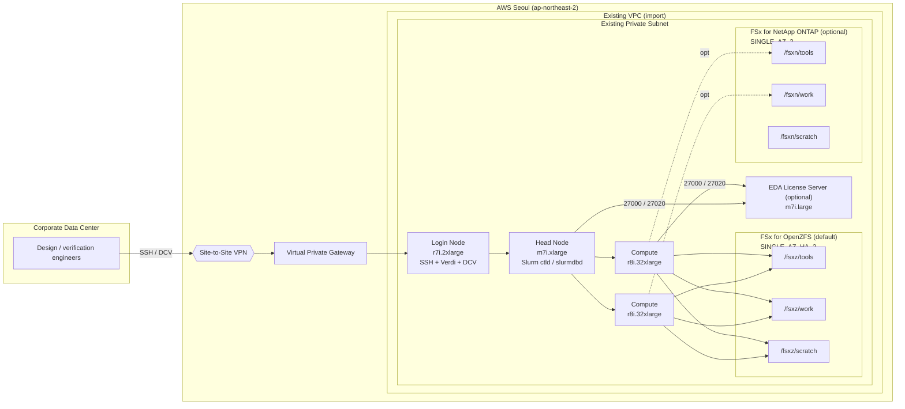

[English](./architecture_guide.md) | [한국어](./architecture_guide.ko.md)

# EDA on AWS — Architecture Guide

This document describes the AWS ParallelCluster + FSx setup used to operate an
EDA simulation/regression environment in the AWS Seoul region.

---

## 1. Assumptions

| Item | Value |
|---|---|
| Region | ap-northeast-2 (Seoul) |
| Corp data center ↔ AWS | Site-to-Site VPN (Virtual Private Gateway) |
| VPC / Subnet | Reuse existing resources (CDK imports rather than creates) |
| Cluster placement | Private subnet |
| Scheduler | Slurm |
| OS | RHEL 8.4+ |
| ParallelCluster | 3.14.x |

The VPC CIDR and the corporate network CIDR are designed not to overlap. [R9]

---

## 2. Overall architecture



Users connect from the corporate network through the VPN to the **private IP**
of the Login Node. When a job is submitted from the Login Node, the Head
Node's Slurm automatically provisions Compute Nodes.

---

## 3. Node configuration

| Role | Instance | Count | Use |
|---|---|---:|---|
| Head Node | `m7i.xlarge` | 1 | Slurm controller, slurmdbd |
| Login Node | `r7i.2xlarge` | 1 | SSH, Verdi GUI, Amazon DCV |
| Compute | `r8i.32xlarge` | 0–2 | VCS simulation / regression (`MinCount=0`, `MaxCount=2`) |

Total capacity: 256 vCPU / 2 TiB memory with 2 Compute nodes. [R15][R16][R17]

---

## 4. Storage

### 4.1 FSx for OpenZFS (default)

The simplest and fastest configuration as the Day 1 default storage.

| Item | Value |
|---|---|
| Deployment type | `SINGLE_AZ_HA_2` (gen 2, NVMe L2ARC cache) |
| Storage capacity | 10 TiB (range: 64 GiB – 512 TiB) |
| Throughput | 2,560 MBps (allowed: 160 / 320 / 640 / 1280 / 2560 / 3840 / 5120 / 7680 / 10240) |
| SSD IOPS | Automatic (3 IOPS/GiB) |
| Backup retention | 7 days |

**Volume layout**

| Volume | Mount | Quota | Reservation | Compression | Purpose |
|---|---|---:|---:|---|---|
| `fsxz_tools` | `/fsxz/tools` | 1 TiB | 256 GiB | ZSTD | EDA tool installs · wrappers · env |
| `fsxz_work` | `/fsxz/work` | 4 TiB | 2 TiB | ZSTD | RTL · TB · results · coverage |
| `fsxz_scratch` | `/fsxz/scratch` | 4 TiB | 0 (thin) | LZ4 | Job workdir |

### 4.2 FSx for NetApp ONTAP (optional)

Add this when you need storage efficiency (65–75% savings), snapshot ·
SnapMirror, or per-file auditing.

| Item | Value |
|---|---|
| Deployment type | `SINGLE_AZ_2` (gen 2) |
| HA pairs | 1 (range: 1–12, 6 GBps / 200K IOPS per HA pair) |
| Throughput per HA | 3,072 MBps (allowed: 1536 / 3072 / 6144) |
| Storage capacity | 10 TiB (range: 1 TiB – 1 PiB) |
| Tiering | NONE (EDA hot data stays on SSD) |
| Backup retention | 7 days |

**Volume layout (SVM: `edasvm`)**

| Volume | Junction | Mount | Size |
|---|---|---|---:|
| `fsxn_tools` | `/fsxn_tools` | `/fsxn/tools` | 1 TiB |
| `fsxn_work` | `/fsxn_work` | `/fsxn/work` | 4 TiB |
| `fsxn_scratch` | `/fsxn_scratch` | `/fsxn/scratch` | 4 TiB |

### 4.3 Strategy when using both storages

When ONTAP is added, the recommended role split is:

| Path | Role |
|---|---|
| `/fsxz/*` | Hot working set (fast working copy, simulation scratch) |
| `/fsxn/work/archive/` | Master data, audit-target (SnapMirror capable) |
| `/fsxn/work/releases/` | Release artifacts (leverages efficiency) |

---

## 5. EDA license server (optional)

Hosting the license server inside AWS avoids VPN latency (10–30 ms) and
removes the dependency on the on-prem VPN.

### 5.1 Configuration

| Item | Value |
|---|---|
| Instance type | `m7i.large` (configurable) |
| OS | RHEL 8 (Red Hat official AMI) |
| Root EBS | 30 GiB gp3, KMS-encrypted |
| Network | Static ENI detached up front → MAC address persists across EC2 replacement |
| SSH key | Dedicated KeyPair (`eda-license-key-{account}`) |
| IAM | `AmazonSSMManagedInstanceCore`, `CloudWatchAgentServerPolicy` |

### 5.2 Security group

| Direction | Port | Source | Use |
|---|---|---|---|
| Ingress | TCP 22 | 0.0.0.0/0 | SSH (private subnet, only reachable via VPN) |
| Ingress | TCP 27000 | `sg_cluster_nodes` | License manager main port |
| Ingress | TCP 27020 | `sg_cluster_nodes` | License vendor daemon port |

The license file **must pin the vendor port** to keep the SG boundary simple.

```
SERVER <hostname> <MAC> 27000
VENDOR <vendor_daemon> PORT=27020
USE_SERVER
```

### 5.3 Initial install procedure

The setup script prints the SSH key and MAC address to the console. The
operator then performs the following manually:

1. Submit the printed MAC address to the EDA tool vendor → receive license file
2. SSH (via VPN):
   `ssh -i ~/.ssh/eda-license-key-<account>.pem ec2-user@<private-ip>`
3. Install 32-bit libraries:
   ```
   sudo dnf -y install glibc.i686 libstdc++.i686 libX11.i686 \
       libXext.i686 libXrender.i686 libgcc.i686 ncurses-libs.i686 lsof
   ```
4. Install the vendor license manager binaries (e.g., `/opt/eda/<vendor>/...`)
5. Place the license file (e.g., `/opt/eda/<vendor>/licenses/license.dat`)
6. Start the vendor license daemon
7. On the cluster, set `export LM_LICENSE_FILE=27000@<private-ip>`

### 5.4 Reusing on-prem servers

When reusing an existing on-prem license server, disable this option. No
license re-issue needed and no cost. Trade-offs: dependency on the VPN
tunnel + added latency.

---

## 6. Slurm configuration

| Item | Value |
|---|---|
| Number of queues | 1 (`eda-r8i`) |
| Compute resource | `r8i.32xlarge`, `MinCount=0`, `MaxCount=2` |
| `EnableMemoryBasedScheduling` | `true` |
| `JobExclusiveAllocation` | `false` (better for many small jobs) |
| `ScaledownIdletime` | 15 min |
| Spot | Not used |

### License resource

Register licenses as a local resource in Slurm to provide a first line of
defense against oversubscription within the cluster. It does not auto-sync
with the external license server, but it is operationally useful. [R29]

```
Licenses=snps_vcs:40,snps_verdi:2
```

When submitting a job: `sbatch --licenses=snps_vcs:1 ...`

### Accounting

Run `slurmdbd` on the Head Node and record into RDS MySQL (or Aurora MySQL).
Track who ran what and how much with `sacct`. [R30]

---

## 7. Network / access

### 7.1 Subnet connectivity requirements

AWS APIs required by the ParallelCluster bootstrap:
CloudFormation, EC2, Auto Scaling, ELB, CloudWatch Logs, SSM, S3, DynamoDB.

The private subnet must satisfy one of:

- Option A: `0.0.0.0/0` → NAT Gateway or Transit Gateway
- Option B: VPC endpoints (Interface + Gateway) for all the services above

The install script verifies this state before deployment and aborts with an
error if neither is available.

### 7.2 Security groups

| SG | Main role |
|---|---|
| `sg_cluster_nodes` | Common to Head / Login / Compute |
| `sg_fsx` | OpenZFS NFS (TCP/UDP 111, 2049, 20001-20003) ← `sg_cluster_nodes` |
| `sg_ontap` | ONTAP NFS + management (TCP 22, 111, 443, 635, 2049, 3260, 4045, 4046, 4420, 4421) ← `sg_cluster_nodes` |
| `sg_license` | License server (TCP 27000, 27020) ← `sg_cluster_nodes`, TCP 22 ← 0.0.0.0/0 (private subnet, only reachable via VPN) |

### 7.3 Access policy

- Engineers connect: corporate network → VPN → **Login Node private IP** [R11]
- Restrict `Ssh.AllowedIps` / `Dcv.AllowedIps` to the corporate CIDR [R31]
- Head Node is accessible only via the `pcluster ssh` command

---

## 8. NFS mount

**OpenZFS export defaults**: `rw,crossmnt,sync`. Restrict the client range to
the VPC CIDR; do not use `*` or `no_root_squash`. [R24]

**Recommended Linux mount options**: [R21]
```
nfsvers=3,nconnect=16,rsize=1048576,wsize=1048576,timeo=600,_netdev
```

If a tool requires NFS v4.1 file locking, reconfigure that volume only to v4.1.

---

## 9. Directory policy

### 9.1 Default structure

```
/fsxz/tools/
  eda/
  wrappers/
  env/

/fsxz/work/
  projects/chipA/{rtl, tb, filelist, scripts, releases}/
  results/chipA/{nightly, release_qual}/
  coverage/chipA/

/fsxz/scratch/
  ${USER}/${SLURM_JOB_ID}/
```

### 9.2 Operational rules

1. Run simulation / regression in **`/fsxz/scratch/$USER/$SLURM_JOB_ID`**
2. Promote only what should be retained to `/fsxz/work/results` or
   `/fsxn/work/archive`
3. Only platform admins modify `/fsxz/tools`
4. `/home` is for shell config / dotfiles; do not store project data there

### 9.3 `/home` policy

Use the ParallelCluster default behavior (Head Node `/home` shared) as-is.
When the user count grows or AD integration becomes necessary, consider
mounting external storage directly.

---

## 10. Backup / snapshots

| Target | Strategy |
|---|---|
| FSx OpenZFS | Automatic backup 7 days; create user snapshots manually for `/fsxz/work` · `/fsxz/tools` right before releases / tool updates |
| FSx ONTAP | Automatic backup 7 days; default snapshot policy (6 hourly / 2 daily / 2 weekly) |
| License server | No separate auto-snapshot. Back up license files · SCL binaries to S3 separately |

---

## 11. Choosing whether to use a Login Node

The Login Node is enabled by default (`Count=1`) and EDA team practice
typically prefers having a dedicated submission host. Consider disabling it
only in these cases.

- Engineers have on-prem Linux workstations and enough Slurm experience
- A CI/CD pipeline submits the jobs

When disabling, the on-prem client must satisfy:

1. **Same Slurm version** as the Head Node
2. Synced `/etc/slurm/slurm.conf`
3. Copy of `/etc/munge/munge.key` + running `munge` daemon
4. **Same UID/GID** as the cluster users
5. Add a TCP 6817 (slurmctld) allow rule on `sg_cluster_nodes`

Benefits of keeping the Login Node:

- Verdi GUI / DCV ready to use
- Consistent environment (OS · compiler · tools)
- Easier debugging / reproduction

---

## 12. Initial value summary

### Cluster

| Item | Value |
|---|---|
| Region | ap-northeast-2 |
| ParallelCluster | 3.14.x |
| Scheduler | Slurm |
| OS | RHEL 8.4+ |
| Number of queues | 1 |
| Spot | Not used |

### Nodes

| Role | Instance | Count |
|---|---|---:|
| Head Node | `m7i.xlarge` | 1 |
| Login Node | `r7i.2xlarge` | 1 |
| Compute | `r8i.32xlarge` | 0–2 |
| License server (optional) | `m7i.large` | 1 |

### Storage

| Item | OpenZFS (default) | ONTAP (optional) |
|---|---|---|
| Deployment | `SINGLE_AZ_HA_2` | `SINGLE_AZ_2` |
| Capacity | 10 TiB | 10 TiB |
| Throughput | 2,560 MBps | 3,072 MBps × 1 HA |

---

## 13. Deployment options

### 13.1 Configuration files

All deployment options are declared in `config/default.env`. The install
script auto-loads them at runtime.

```
config/
├── default.env     # Defaults (included in the project)
└── example.env     # Per-environment example — copy and edit
```

**File contents example (`config/default.env`)**:

```bash
REGION="ap-northeast-2"
CLUSTER_NAME="hpc-cluster"

VPC_ID=""          # Existing VPC ID
SUBNET_ID=""       # Existing private subnet ID

ENABLE_OPENZFS=1
OPENZFS_SIZE_GIB=10240
OPENZFS_THROUGHPUT=2560

ENABLE_ONTAP=0
ENABLE_LICENSE_SERVER=1
ENABLE_LOGIN_NODE=1
ENABLE_VPC_ENDPOINTS=1
```

### 13.2 Configuration precedence

When the same variable is set in multiple places, **top-down** precedence
applies.

1. **Shell environment variable** (`VPC_ID=xxx ./setup.sh`)
2. **CONFIG file** (`CONFIG=config/prod.env ./setup.sh` or default `config/default.env`)
3. **Script-internal fallback** (final safety net)

### 13.3 Full options

| Variable | Default | Description |
|---|---|---|
| `VPC_ID` | (required) | Existing VPC ID |
| `SUBNET_ID` | (required) | Private subnet ID |
| `REGION` | `ap-northeast-2` | AWS region |
| `CLUSTER_NAME` | `hpc-cluster` | ParallelCluster name |
| `ENABLE_OPENZFS` | `1` | Whether to create FSx OpenZFS |
| `OPENZFS_SIZE_GIB` | `10240` | OpenZFS capacity (64 – 524,288) |
| `OPENZFS_THROUGHPUT` | `2560` | OpenZFS throughput (9 allowed values) |
| `ENABLE_ONTAP` | `0` | Whether to create FSx ONTAP |
| `ONTAP_SIZE_GIB` | `10240` | ONTAP capacity (1,024 – 1,048,576) |
| `ONTAP_TPUT_PER_HA` | `3072` | Throughput per HA pair (1536 / 3072 / 6144) |
| `ONTAP_HA_PAIRS` | `1` | Number of HA pairs (1 – 12) |
| `ENABLE_LICENSE_SERVER` | `1` | Whether to create the EDA license server EC2 |
| `LICENSE_INSTANCE_TYPE` | `m7i.large` | License server instance type |
| `ENABLE_LOGIN_NODE` | `1` | Whether to create the Login Node |
| `ENABLE_SSM` | `0` | Enable SSM Session Manager |
| `ENABLE_VPC_ENDPOINTS` | `1` | Auto-create required VPC endpoints |

### 13.4 Examples

```bash
# 1) Run with the default config file
# Fill VPC_ID/SUBNET_ID in config/default.env first, then:
./setup.sh

# 2) Per-environment config file
cp config/example.env config/prod.env
$EDITOR config/prod.env
CONFIG=config/prod.env ./setup.sh

# 3) Override individual values via env (keep config file, change a few)
VPC_ID=vpc-xxx SUBNET_ID=subnet-yyy ./setup.sh

# 4) Full env override (ONTAP 2 HA + license server)
VPC_ID=vpc-xxx SUBNET_ID=subnet-yyy \
  ENABLE_OPENZFS=1 OPENZFS_THROUGHPUT=5120 \
  ENABLE_ONTAP=1 ONTAP_HA_PAIRS=2 ONTAP_TPUT_PER_HA=6144 ONTAP_SIZE_GIB=20480 \
  ./setup.sh

# 5) Without Login Node — submit directly from on-prem
VPC_ID=vpc-xxx SUBNET_ID=subnet-yyy ENABLE_LOGIN_NODE=0 ./setup.sh
```

---

## 14. Operational flow

```mermaid
flowchart TD
    A[Engineer connects via VPN] --> B[sbatch on Login Node]
    B --> C[Head Node / Slurm]
    C --> D[Compute Node starts]
    D --> E[/fsxz/scratch as workdir]
    D --> F[/fsxz/work/results final artifacts]
    D --> L[License Server 27000/27020 checkout]
    F --> G[Debug with Verdi on Login Node]
    G --> H[Edit RTL/TB]
    H --> B
```

**Core principles**

- Execution happens on Compute Nodes
- Analysis happens on the Login Node (Verdi / DCV)
- Permanent storage is `/fsxz/work` (or `/fsxn/work/archive`)
- Temporary data lives in `/fsxz/scratch`
- `/home` is not a project repository

---

## 15. Scaling scenarios

| When | Symptom | Response |
|---|---|---|
| Compute bottleneck | `r8i` saturated / increase in small jobs | Add `c7i` queue, split queues |
| Login Node bottleneck | 2+ Verdi users at the same time, 64 GiB not enough | Split a Verdi-dedicated EC2, increase Login pool count |
| Storage efficiency need | Storage cost grows, audit needed | Enable ONTAP (storage efficiency, per-file audit) |
| License capacity | License manager throughput limit | Upsize instance type, triad redundancy |
| Multi-cluster | Multiple clusters share accounting / licenses | ExternalSlurmdbd, central license server |

---

## 16. Cost overview (monthly, on-demand)

| Configuration | Amount (USD) |
|---|---:|
| Minimum (OpenZFS only, Compute 50% utilization) | ~$3,100 |
| Default + license server | ~$3,180 |
| Full options (ONTAP included) | ~$7,700 |

Major savings:

- Remove Login Node (on-prem submission): -$460
- Reuse on-prem license server: -$78
- Compute on Spot: -50% (~ -$1,200)
- OpenZFS throughput 2560 → 1280: ~30% storage cost savings

---

## 17. Items not included in Day 1

For initial-build simplicity, the following items are explicitly excluded.
Consider adopting them after observing actual bottlenecks.

- Spot queue
- Multiple queues (`compile`, `smoke`, `regression` separation)
- Verdi-dedicated EC2
- Custom AMI
- External Slurmdbd
- ONTAP block protocol (iSCSI / NVMe-oF)
- FSx cross-region replication (SnapMirror)
- License server triad redundancy

---

## 18. References

### AWS ParallelCluster
- [R1] FSx ONTAP / OpenZFS / File Cache shared storage — <https://docs.aws.amazon.com/parallelcluster/latest/ug/shared-storage-config-ontap-zfs-v3.html>
- [R4] Support policy — <https://docs.aws.amazon.com/parallelcluster/latest/ug/support-policy.html>
- [R5] Operating systems — <https://docs.aws.amazon.com/parallelcluster/latest/ug/operating-systems-v3.html>
- [R11] Login nodes — <https://docs.aws.amazon.com/parallelcluster/latest/ug/login-nodes-v3.html>
- [R12] Networking for login nodes — <https://docs.aws.amazon.com/parallelcluster/latest/ug/login-nodes-networking.html>
- [R13] DCV access — <https://docs.aws.amazon.com/parallelcluster/latest/ug/dcv-v3.html>
- [R14] Single-subnet / no-internet prerequisites — <https://docs.aws.amazon.com/parallelcluster/latest/ug/aws-parallelcluster-in-a-single-public-subnet-no-internet-v3.html>
- [R25] Internal directories — <https://docs.aws.amazon.com/parallelcluster/latest/ug/directories-v3.html>
- [R26] Scheduling (`JobExclusiveAllocation`) — <https://docs.aws.amazon.com/parallelcluster/latest/ug/Scheduling-v3.html>
- [R27] Slurm memory-based scheduling — <https://docs.aws.amazon.com/parallelcluster/latest/ug/slurm-mem-based-scheduling-v3.html>
- [R30] Slurm accounting — <https://docs.aws.amazon.com/parallelcluster/latest/ug/slurm-accounting-v3.html>
- [R31] LoginNodes section / DCV AllowedIps — <https://docs.aws.amazon.com/parallelcluster/latest/ug/LoginNodes-v3.html>

### EDA tool vendor docs
- [R6] Supported Platforms Guide Y-Foundation — <https://www.synopsys.com/support/licensing-installation-computeplatforms/compute-platforms/release-specific-support/supported-y-foundation.html>
- [R28] SCL Supported OS — <https://www.synopsys.com/support/licensing-installation-computeplatforms/licensing/scl-supported-os.html>

### Amazon EC2
- [R15] M7i instance — <https://aws.amazon.com/ec2/instance-types/m7i/>
- [R16] R7i instance — <https://aws.amazon.com/ec2/instance-types/memory-optimized/>
- [R17] R8i instance — <https://aws.amazon.com/ec2/instance-types/r8i>

### AWS Site-to-Site VPN
- [R9] Overview — <https://docs.aws.amazon.com/vpn/latest/s2svpn/VPC_VPN.html>
- [R10] How it works — <https://docs.aws.amazon.com/vpn/latest/s2svpn/how_it_works.html>

### FSx for OpenZFS
- [R1S-1] `CreateFileSystemOpenZFSConfiguration` API — <https://docs.aws.amazon.com/fsx/latest/APIReference/API_CreateFileSystemOpenZFSConfiguration.html>
- [R1S-2] Performance / NVMe L2ARC — <https://docs.aws.amazon.com/fsx/latest/OpenZFSGuide/performance-ssd.html>
- [R1S-3] Deployment types per region — <https://docs.aws.amazon.com/fsx/latest/OpenZFSGuide/availability-durability.html>
- [R21] Performance guidance — <https://docs.aws.amazon.com/fsx/latest/OpenZFSGuide/performance.html>
- [R24] Updating a volume — <https://docs.aws.amazon.com/fsx/latest/OpenZFSGuide/updating-volumes.html>
- [R34] Snapshots — <https://docs.aws.amazon.com/fsx/latest/OpenZFSGuide/snapshots-openzfs.html>

### FSx for NetApp ONTAP
- [R1S-4] `CreateFileSystemOntapConfiguration` API — <https://docs.aws.amazon.com/fsx/latest/APIReference/API_CreateFileSystemOntapConfiguration.html>
- [R1S-5] HA pairs — <https://docs.aws.amazon.com/fsx/latest/ONTAPGuide/HA-pairs.html>
- [R1S-7] Security groups / port requirements — <https://docs.aws.amazon.com/fsx/latest/ONTAPGuide/limit-access-security-groups.html>

### Slurm
- [R29] Licenses Guide — <https://slurm.schedmd.com/licenses.html>
