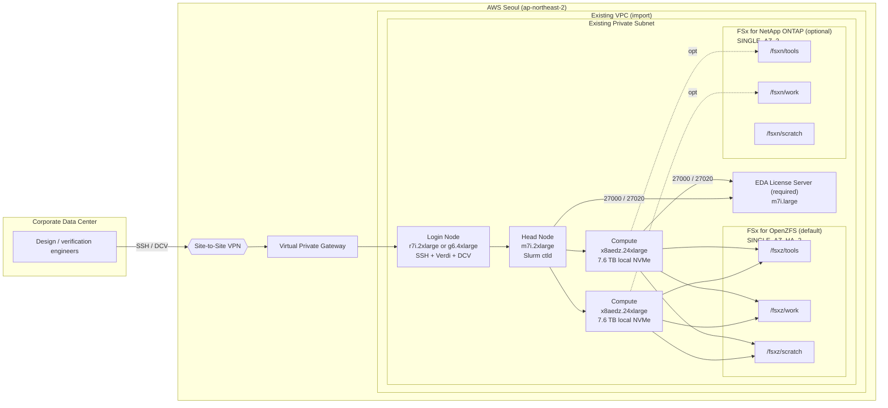
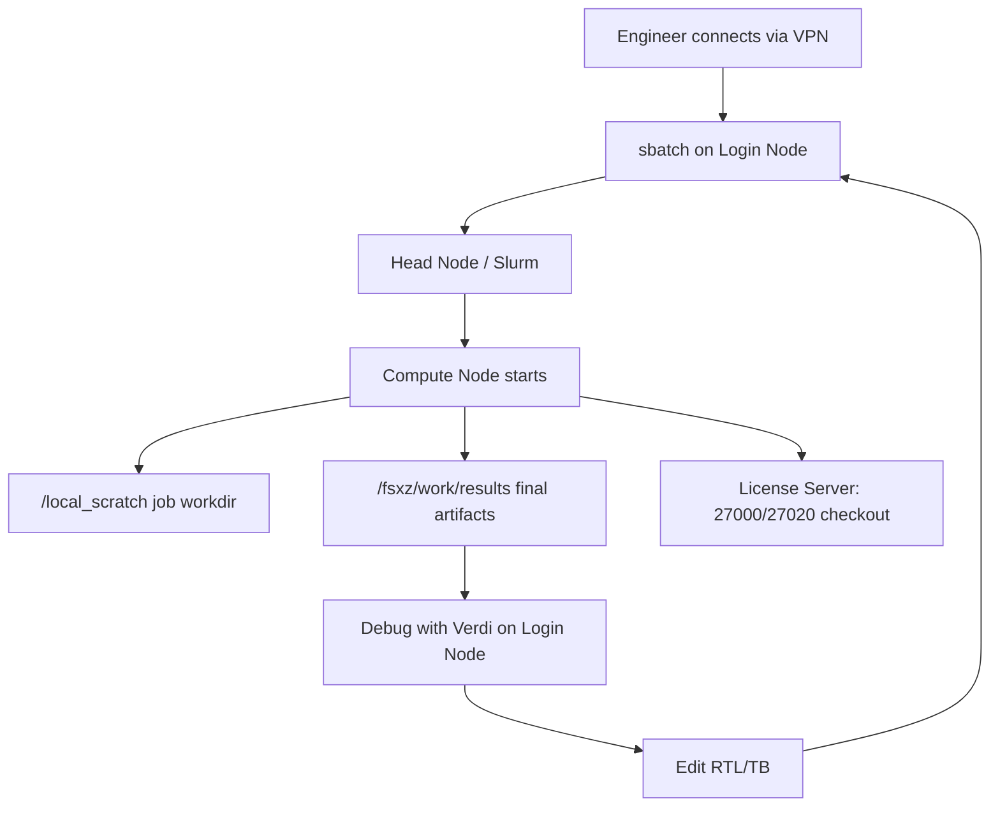

[English](./architecture_guide.md) | [한국어](./architecture_guide.ko.md)

# EDA on AWS — Architecture Guide

This document describes the AWS ParallelCluster + FSx setup used to operate an
EDA simulation/regression environment in the AWS Seoul region.

---

## 1. Assumptions

| Item | Value |
|---|---|
| Region | ap-northeast-2 (Seoul) |
| Corp data center ↔ AWS | Site-to-Site VPN (Virtual Private Gateway) |
| VPC / Subnet | Reuse existing resources (CDK imports rather than creates) |
| Cluster placement | Private subnet |
| Scheduler | Slurm |
| OS | RHEL 8.4+ |
| ParallelCluster | 3.15.x (validated with 3.15.1) |

The VPC CIDR and the corporate network CIDR are designed not to overlap. [R9]

---

## 2. Overall architecture


```mermaid
flowchart LR
    subgraph ONPREM["Corporate Data Center"]
        USERS["Design / verification engineers"]
    end

    USERS -->|SSH / DCV| VPN
    VPN{{"Site-to-Site VPN"}}

    subgraph AWS["AWS Seoul (ap-northeast-2)"]
        VGW["Virtual Private Gateway"]
        VPN --> VGW

        subgraph VPC["Existing VPC (import)"]
            subgraph PRIVATE["Existing Private Subnet"]
                LOGIN["Login Node<br/>r7i.2xlarge or g6.4xlarge<br/>SSH + Verdi + DCV"]
                HEAD["Head Node<br/>m7i.2xlarge<br/>Slurm ctld"]
                C1["Compute<br/>x8aedz.24xlarge<br/>7.6 TB local NVMe"]
                C2["Compute<br/>x8aedz.24xlarge<br/>7.6 TB local NVMe"]

                subgraph ZFS["FSx for OpenZFS (default)<br/>SINGLE_AZ_HA_2"]
                    ZT["/fsxz/tools"]
                    ZW["/fsxz/work"]
                    ZS["/fsxz/scratch"]
                end

                subgraph NTAP["FSx for NetApp ONTAP (optional)<br/>SINGLE_AZ_2"]
                    NT["/fsxn/tools"]
                    NW["/fsxn/work"]
                    NS["/fsxn/scratch"]
                end

                LIC["EDA License Server (required)<br/>m7i.large"]
            end
        end
    end

    VGW --> LOGIN
    LOGIN --> HEAD
    HEAD --> C1
    HEAD --> C2
    C1 --> ZT & ZW & ZS
    C2 --> ZT & ZW & ZS
    C1 -. opt .-> NT
    C2 -. opt .-> NW
    C1 -->|27000 / 27020| LIC
    HEAD -->|27000 / 27020| LIC
```

Users connect from the corporate network through the VPN to the **private IP**
of the Login Node. When a job is submitted from the Login Node, the Head
Node's Slurm automatically provisions Compute Nodes.

---

## 3. Node configuration

| Role | Instance | Count | Use |
|---|---|---:|---|
| Head Node | `m7i.2xlarge` | 1 | Slurm controller |
| Login Node | `r7i.2xlarge` / `g6.4xlarge` | 1 | `r7i.2xlarge` normally; `g6.4xlarge` with DCV |
| Compute | `x8aedz.24xlarge` | 0–2 | PowerArtist scratch, VCS simulation / regression (`MinCount=0`, `MaxCount=2`) |

Total capacity: 192 vCPU / 6 TiB memory / 15.2 TB ephemeral local NVMe with
2 Compute nodes. The preflight checks the selected single-subnet AZ at runtime;
the current Seoul offering was verified in `ap-northeast-2a`. [R15][R16][R17]

---

## 4. Storage

### 4.1 FSx for OpenZFS (default)

The simplest and fastest configuration as the Day 1 default storage.

| Item | Value |
|---|---|
| Deployment type | `SINGLE_AZ_HA_2` (gen 2, NVMe L2ARC cache) |
| Storage capacity | 32 TiB / 32,768 GiB (project range: 16–32 TiB) |
| Throughput | 7,680 MBps (one tier below the maximum) |
| SSD IOPS | 300,000, `USER_PROVISIONED` (below the 307,200 tier maximum) |
| File-server cache | File-server memory and managed NVMe L2ARC |
| Backup retention | 7 days |

**Volume layout**

| Volume | Mount | Quota | Reservation | Compression | Purpose |
|---|---|---:|---:|---|---|
| `fsxz_tools` | `/fsxz/tools` | 3,276 GiB | 655 GiB | ZSTD | EDA tool installs · wrappers · env |
| `fsxz_work` | `/fsxz/work` | 13,107 GiB | 6,553 GiB | ZSTD | RTL · TB · results · coverage |
| `fsxz_scratch` | `/fsxz/scratch` | 13,107 GiB | 0 (thin) | LZ4 | Shared job staging / non-local temporary data |

The setup calculates these quotas and reservations from the configured parent
capacity. The values above are the layout produced by the 32 TiB project
default.

The 7,680 MBps / 300,000 IOPS default is one tier below the maximum. OpenZFS
quotas apply to the aggregate of file systems in the Region, so include existing
throughput and disk-IOPS usage when checking available quota. [R1S-1][R1S-2]

### 4.2 FSx for NetApp ONTAP (optional)

FSx for ONTAP is disabled by default. Use it instead of or alongside OpenZFS
when you need to reduce storage consumed by duplicate project data, restore
individual files from snapshots, replicate data, or use NetApp operational
features. ONTAP provides compression, compaction, and deduplication. AWS gives
an example of up to 65% savings for general file-share workloads, but actual
savings for EDA data depend on file formats and duplication. Measure them with
the CloudWatch `LogicalDataStored` and `StorageUsed` metrics. [R1S-6]

This project connects ONTAP to ParallelCluster only as **NFS shared storage**.
ONTAP also supports SMB, iSCSI, NVMe/TCP, SnapMirror, and file-access auditing,
but the stack does not configure those features. They require separate
post-deployment design and configuration. [R1][R1S-9]

| Item | Value |
|---|---|
| Deployment type | `SINGLE_AZ_2` (gen 2) |
| Availability scope | Active-standby HA within one AZ; no protection from an AZ outage |
| HA pairs | 1 (range: 1–12, up to 6 GBps / 200K SSD IOPS per HA pair) |
| Throughput per HA | 3,072 MBps (allowed: 1536 / 3072 / 6144) |
| SSD storage capacity | 10 TiB (range: 1 TiB – 1 PiB, maximum 512 TiB per HA pair) |
| SSD IOPS | Automatic |
| Tiering | NONE (EDA hot data stays on SSD) |
| Storage efficiency | Enabled on each data volume |
| Snapshot policy | ONTAP `default` (retains 6 hourly, 2 daily, and 2 weekly snapshots) |
| Automatic backup | 7-day retention |
| Encryption | Data at rest encrypted with a customer-managed KMS key |

**Resources created by this project**

- One FSx for ONTAP file system and one Storage Virtual Machine named `edasvm`
- Three NFS FlexVol volumes mounted automatically under `/fsxn/*` by ParallelCluster
- A Secrets Manager secret containing a generated `fsxadmin` password
- A dedicated security group allowing required ONTAP ports from the Cluster Node security group
- CloudFormation outputs and SSM parameters containing file-system, SVM, and volume IDs

**Volume layout**

| Volume | Junction | Cluster mount | Logical size | Purpose |
|---|---|---|---:|---|
| `fsxn_tools` | `/fsxn_tools` | `/fsxn/tools` | 1 TiB | EDA tools and shared environments |
| `fsxn_work` | `/fsxn_work` | `/fsxn/work` | 4 TiB | Projects, results, and releases |
| `fsxn_scratch` | `/fsxn_scratch` | `/fsxn/scratch` | 4 TiB | Temporary working data |

The 1/4/4 TiB sizes are fixed **logical sizes** in the current CDK and do not
scale automatically with `ONTAP_SIZE_GIB`. ONTAP uses thin provisioning, but
tiering is disabled, so actual data, metadata, and snapshot changes must fit
within the provisioned SSD capacity.

**Operational considerations**

- `SINGLE_AZ_2` automatically fails over after a file-server failure, but it
  does not protect against an entire AZ outage. For separate disaster
  recovery, design SnapMirror replication to another file system or a backup
  restore strategy. [R1S-5]
- ONTAP snapshots consume SSD capacity for changed blocks and are separate
  from automatic backups. Monitor snapshot usage for write-intensive
  workloads. [R1S-8]
- SnapMirror, file-access auditing, SMB, iSCSI, and NVMe/TCP are supported
  capabilities, but this project does not enable them automatically.
- Setting both `ENABLE_OPENZFS=1` and `ENABLE_ONTAP=1` creates and charges for
  both file systems. Set `ENABLE_OPENZFS=0` when ONTAP should be the only
  shared storage.
- The file system, SVM, volumes, and KMS key use `RETAIN`. They can continue
  incurring charges after stack deletion and must be removed separately after
  the data has been reviewed.

### 4.3 Strategy when using both storages

When ONTAP is added, the recommended role split is:

| Path | Role |
|---|---|
| `/fsxz/*` | Hot working set (fast working copy, simulation scratch) |
| `/fsxn/work/archive/` | Master data, audit-target (SnapMirror capable) |
| `/fsxn/work/releases/` | Release artifacts (leverages efficiency) |

---

## 5. EDA license server (required)

Every deployment creates a dedicated license server inside AWS. The default
operating model is a Synopsys SCL/FlexNet floating license server, avoiding
license checkout latency and dependency on the on-prem VPN.

### 5.1 Configuration

| Item | Value |
|---|---|
| Instance type | `m7i.large` (configurable) |
| OS | RHEL 8 (Red Hat official AMI) |
| Root EBS | 30 GiB gp3, KMS-encrypted |
| Network | Static ENI detached up front → MAC address persists across EC2 replacement |
| SSH key | Dedicated KeyPair (`eda-license-key-{account}`) |
| IAM | `AmazonSSMManagedInstanceCore`, `CloudWatchAgentServerPolicy` |
| Default license model | Synopsys SCL/FlexNet floating license |
| Default ports | `lmgrd` TCP 27000, fixed `snpslmd` TCP 27020 |

### 5.2 Security group

| Direction | Port | Source | Use |
|---|---|---|---|
| Ingress | TCP 22 | 0.0.0.0/0 | SSH (private subnet, only reachable via VPN) |
| Ingress | TCP 27000 | `sg_cluster_nodes` | `lmgrd` manager port (configurable) |
| Ingress | TCP 27020 | `sg_cluster_nodes` | `snpslmd` vendor port (configurable) |

The license file **must pin the vendor port** to keep the SG boundary simple.

```
SERVER <hostname> <MAC> 27000
VENDOR snpslmd PORT=27020
USE_SERVER
```

### 5.3 Initial install procedure

The setup script prints the SSH key and MAC address to the console. The
operator then performs the following manually:

1. Submit the printed MAC address to the EDA tool vendor → receive license file
2. SSH (via VPN):
   `ssh -i ~/.ssh/eda-license-key-<account>.pem ec2-user@<private-ip>`
3. Optional: only if the vendor documentation requires a 32-bit runtime, install
   the corresponding libraries:
   ```
   sudo dnf -y install glibc.i686 libstdc++.i686 libX11.i686 \
       libXext.i686 libXrender.i686 libgcc.i686 ncurses-libs.i686 lsof
   ```
   This is not an AWS stack deployment requirement. In an isolated network, the
   command requires an available internal RPM repository or offline packages.
4. Install Synopsys SCL or the selected vendor's license manager binaries
5. Place the license file (e.g., `/opt/eda/<vendor>/licenses/license.dat`)
6. Start the vendor license daemon
7. Configure the manager server for floating-license clients on the cluster
   (default port: 27000):
   ```bash
   export SNPSLMD_LICENSE_FILE=27000@<license-server-private-ip>
   # Also set this for tools that read only the generic FlexNet variable
   export LM_LICENSE_FILE="${SNPSLMD_LICENSE_FILE}"
   ```

The `port@host` form is the standard way for a floating-license client to find
`lmgrd`. The client first connects to manager port 27000 and is then directed
to the fixed `snpslmd` port 27020. The environment variable therefore contains
only the manager port, while the security group must allow both ports. An
`export` affects only the current shell; configure the same values in a
modulefile or `/etc/profile.d/synopsys-license.sh` for cluster-wide persistence.

### 5.4 Other license vendors

The EC2 license server remains mandatory when another FlexNet-compatible vendor
is used. Set `LICENSE_MANAGER_PORT` and `LICENSE_VENDOR_PORT` to the ports fixed
in that vendor's license file. Only those configured ports are opened from the
cluster security group.

---

## 6. Slurm configuration

| Item | Value |
|---|---|
| Number of queues | 1 (`eda-x8aedz`) |
| Compute resource | `x8aedz.24xlarge`, `MinCount=0`, `MaxCount=2` |
| `EnableMemoryBasedScheduling` | `true` |
| `JobExclusiveAllocation` | `false` (better for many small jobs) |
| `ScaledownIdletime` | 15 min |
| Spot | Not used |

This Day 1 configuration does not include RDS or `slurmdbd` for persistent
Slurm job accounting. Consequently, historical `sacct` queries are not
available. Operators use job output files and live `squeue` status instead.
Design and add Slurm accounting separately when long-term history or
department-level usage analysis becomes necessary.

---

## 7. Network / access

### 7.1 Security groups

| SG | Main role |
|---|---|
| `sg_cluster_nodes` | Common to Head / Login / Compute |
| `sg_fsx` | OpenZFS NFS (TCP/UDP 111, 2049, 20001-20003) ← `sg_cluster_nodes` |
| `sg_ontap` | ONTAP NFS + management (TCP 22, 111, 443, 635, 2049, 3260, 4045, 4046, 4420, 4421) ← `sg_cluster_nodes` |
| `sg_license` | License server (TCP 27000, 27020) ← `sg_cluster_nodes`, TCP 22 ← 0.0.0.0/0 (private subnet, only reachable via VPN) |

### 7.2 Access policy

- Engineers connect: corporate network → VPN → **Login Node private IP** [R11]
- Restrict `Ssh.AllowedIps` / `Dcv.AllowedIps` to the corporate CIDR [R31]
- Head Node is accessible only via the `pcluster ssh` command

---

## 8. Directory policy

The following structure and operating rules are reference examples for EDA
workloads. Customers should design and use their directory layout and
permission policy according to their project organization, user and group
access model, data-retention, and backup policies.

### 8.1 Example structure

```
/fsxz/tools/
  eda/
  wrappers/
  env/

/fsxz/work/
  projects/chipA/{rtl, tb, filelist, scripts, releases}/
  results/chipA/{nightly, release_qual}/
  coverage/chipA/

/fsxz/scratch/
  ${USER}/${SLURM_JOB_ID}/
```

### 8.2 Operational rules

1. Run simulation / regression in **`/fsxz/scratch/$USER/$SLURM_JOB_ID`**
2. Promote only what should be retained to `/fsxz/work/results` or
   `/fsxn/work/archive`
3. Only platform admins modify `/fsxz/tools`
4. `/home` is for shell config / dotfiles; do not store project data there

### 8.3 `/home` policy

Use the ParallelCluster default behavior (Head Node `/home` shared) as-is.
When the user count grows or AD integration becomes necessary, consider
mounting external storage directly.

---

## 9. Backup / snapshots

| Target | Strategy |
|---|---|
| FSx OpenZFS | Automatic backup 7 days; create user snapshots manually for `/fsxz/work` · `/fsxz/tools` right before releases / tool updates |
| FSx ONTAP | Automatic backup 7 days; default snapshot policy (6 hourly / 2 daily / 2 weekly) |
| License server | No separate auto-snapshot. Back up license files · SCL binaries to S3 separately |

---

## 10. Initial configuration of the deployed cluster

The following values are the baseline configuration when this project first
deploys the cluster. If settings have changed during operations, verify the
current values in the CloudFormation stack, ParallelCluster configuration, and
AWS Console.

### Cluster

| Item | Value |
|---|---|
| Region | ap-northeast-2 |
| ParallelCluster | 3.15.x (validated with 3.15.1) |
| Scheduler | Slurm |
| OS | RHEL 8.4+ |
| Number of queues | 1 |
| Spot | Not used |

### Nodes

| Role | Instance | Count |
|---|---|---:|
| Head Node | `m7i.2xlarge` | 1 |
| Login Node | `r7i.2xlarge` / `g6.4xlarge` | 1 |
| Compute | `x8aedz.24xlarge` | 0–2 |
| License server (required) | `m7i.large` | 1 |

### Storage

| Item | OpenZFS (default) | ONTAP (optional) |
|---|---|---|
| Deployment | `SINGLE_AZ_HA_2` | `SINGLE_AZ_2` |
| Capacity | 32 TiB | 10 TiB |
| Throughput / IOPS | 7,680 MBps / 300,000 | 3,072 MBps × 1 HA / Automatic |

---

## 11. Deployment options

### 11.1 Configuration files

All deployment options are declared in `config/default.env`. The install
script auto-loads them at runtime.

```
config/
├── default.env     # Defaults (included in the project)
└── example.env     # Per-environment example — copy and edit
```

**File contents example (`config/default.env`)**:

```bash
REGION="ap-northeast-2"
CLUSTER_NAME="hpc-cluster"

VPC_ID=""          # Existing VPC ID
SUBNET_ID=""       # Existing private subnet ID

ENABLE_OPENZFS=1
OPENZFS_SIZE_GIB=32768
OPENZFS_THROUGHPUT=7680
OPENZFS_IOPS=300000

ENABLE_ONTAP=0
LICENSE_INSTANCE_TYPE="m7i.large"
LICENSE_MANAGER_PORT=27000
LICENSE_VENDOR_PORT=27020
ENABLE_VPC_ENDPOINTS=1
```

### 11.2 Configuration precedence

When the same variable is set in multiple places, **top-down** precedence
applies.

1. **Shell environment variable** (`VPC_ID=xxx ./setup.sh`)
2. **CONFIG file** (`CONFIG=config/prod.env ./setup.sh` or default `config/default.env`)
3. **Script-internal fallback** (final safety net)

### 11.3 Full options

| Variable | Default | Description |
|---|---|---|
| `VPC_ID` | (required) | Existing VPC ID |
| `SUBNET_ID` | (required) | Private subnet ID |
| `REGION` | `ap-northeast-2` | AWS region |
| `CLUSTER_NAME` | `hpc-cluster` | ParallelCluster name |
| `ENABLE_OPENZFS` | `1` | Whether to create FSx OpenZFS |
| `OPENZFS_SIZE_GIB` | `32768` | OpenZFS capacity (16,384 – 32,768; 16–32 TiB project range) |
| `OPENZFS_THROUGHPUT` | `7680` | OpenZFS throughput (9 allowed values) |
| `OPENZFS_IOPS` | `300000` | User-provisioned IOPS; at least 3 IOPS/GiB, at most the file-server tier and regional limit |
| `ENABLE_ONTAP` | `0` | Whether to create FSx ONTAP |
| `ONTAP_SIZE_GIB` | `10240` | ONTAP capacity (1,024 – 1,048,576) |
| `ONTAP_TPUT_PER_HA` | `3072` | Throughput per HA pair (1536 / 3072 / 6144) |
| `ONTAP_HA_PAIRS` | `1` | Number of HA pairs (1 – 12) |
| `LICENSE_INSTANCE_TYPE` | `m7i.large` | License server instance type |
| `LICENSE_MANAGER_PORT` | `27000` | Manager port (`lmgrd` by default) |
| `LICENSE_VENDOR_PORT` | `27020` | Fixed vendor daemon port (`snpslmd` by default) |
| `ENABLE_SSM` | `0` | Enable SSM Session Manager |
| `ENABLE_VPC_ENDPOINTS` | `1` | Auto-create required VPC endpoints |

### 11.4 Examples

```bash
# 1) Run with the default config file
# Fill VPC_ID/SUBNET_ID in config/default.env first, then:
./setup.sh

# 2) Per-environment config file
cp config/example.env config/prod.env
$EDITOR config/prod.env
CONFIG=config/prod.env ./setup.sh

# 3) Override individual values via env (keep config file, change a few)
VPC_ID=vpc-xxx SUBNET_ID=subnet-yyy ./setup.sh

# 4) Full env override (ONTAP 2 HA + license server)
VPC_ID=vpc-xxx SUBNET_ID=subnet-yyy \
  ENABLE_OPENZFS=1 OPENZFS_THROUGHPUT=7680 OPENZFS_IOPS=300000 \
  ENABLE_ONTAP=1 ONTAP_HA_PAIRS=2 ONTAP_TPUT_PER_HA=6144 ONTAP_SIZE_GIB=20480 \
  ./setup.sh

```

---

## 12. Operational flow


```mermaid
flowchart TD
    A["Engineer connects via VPN"] --> B["sbatch on Login Node"]
    B --> C["Head Node / Slurm"]
    C --> D["Compute Node starts"]
    D --> E["/local_scratch job workdir"]
    D --> F["/fsxz/work/results final artifacts"]
    D --> L["License Server: 27000/27020 checkout"]
    F --> G["Debug with Verdi on Login Node"]
    G --> H["Edit RTL/TB"]
    H --> B
```

**Core principles**

- Execution happens on Compute Nodes
- Analysis happens on the Login Node (Verdi / DCV)
- Permanent storage is `/fsxz/work` (or `/fsxn/work/archive`)
- PowerArtist and other high-I/O temporary data live in `/local_scratch/$SLURM_JOB_ID`
- `/local_scratch` is Compute-node local NVMe and is deleted when the node terminates
- `/fsxz/scratch` is shared staging space, not durable project storage
- `/home` is not a project repository

---

## 13. Scaling scenarios

| When | Symptom | Response |
|---|---|---|
| Compute bottleneck | `x8aedz` saturated / increase in small jobs | Add `c7i` queue, split queues |
| Login Node bottleneck | 2+ Verdi users at the same time, 64 GiB not enough | Split a Verdi-dedicated EC2, increase Login pool count |
| Storage efficiency need | Storage cost grows, audit needed | Enable ONTAP (storage efficiency, per-file audit) |
| License capacity | License manager throughput limit | Upsize instance type, triad redundancy |
| Multi-cluster | Multiple clusters share licenses | Central license server |

---

## 14. Cost overview

The monthly total is not fixed because EC2, FSx, VPC endpoint, log, backup, and
data-transfer charges vary with usage and current Seoul Region pricing.

| Cost class | Default resources |
|---|---|
| Always on | Head Node, Login Node, required License Server, FSx OpenZFS 32 TiB / 7,680 MBps / 300,000 IOPS, Interface VPC endpoints |
| Usage based | `x8aedz.24xlarge` Compute Nodes (`MinCount=0`, `MaxCount=2`), backups, logs, and data transfer |
| Optional | FSx for ONTAP and SSM Interface endpoints |

Create the deployment estimate in [AWS Pricing Calculator](https://calculator.aws/)
for `ap-northeast-2` immediately before approval. EDA software and floating
license fees are not included in AWS infrastructure charges.

---

## 15. Items not included in Day 1

For initial-build simplicity, the following items are explicitly excluded.
Consider adopting them after observing actual bottlenecks.

- Spot queue
- Multiple queues (`compile`, `smoke`, `regression` separation)
- Verdi-dedicated EC2
- Custom AMI
- ONTAP block protocol (iSCSI / NVMe-oF)
- FSx cross-region replication (SnapMirror)
- License server triad redundancy

---

## 16. References

### AWS ParallelCluster
- [R1] FSx ONTAP / OpenZFS / File Cache shared storage — <https://docs.aws.amazon.com/parallelcluster/latest/ug/shared-storage-config-ontap-zfs-v3.html>
- [R4] Support policy — <https://docs.aws.amazon.com/parallelcluster/latest/ug/support-policy.html>
- [R5] Operating systems — <https://docs.aws.amazon.com/parallelcluster/latest/ug/operating-systems-v3.html>
- [R11] Login nodes — <https://docs.aws.amazon.com/parallelcluster/latest/ug/login-nodes-v3.html>
- [R13] DCV access — <https://docs.aws.amazon.com/parallelcluster/latest/ug/dcv-v3.html>
- [R14] Single-subnet / no-internet prerequisites — <https://docs.aws.amazon.com/parallelcluster/latest/ug/aws-parallelcluster-in-a-single-public-subnet-no-internet-v3.html>
- [R25] Internal directories — <https://docs.aws.amazon.com/parallelcluster/latest/ug/directories-v3.html>
- [R26] Scheduling (`JobExclusiveAllocation`) — <https://docs.aws.amazon.com/parallelcluster/latest/ug/Scheduling-v3.html>
- [R27] Slurm memory-based scheduling — <https://docs.aws.amazon.com/parallelcluster/latest/ug/slurm-mem-based-scheduling-v3.html>
- [R31] LoginNodes section / DCV AllowedIps — <https://docs.aws.amazon.com/parallelcluster/latest/ug/LoginNodes-v3.html>

### EDA tool vendor docs
- [R6] Supported Platforms Guide Y-Foundation — <https://www.synopsys.com/support/licensing-installation-computeplatforms/compute-platforms/release-specific-support/supported-y-foundation.html>
- [R28] SCL Supported OS — <https://www.synopsys.com/support/licensing-installation-computeplatforms/licensing/scl-supported-os.html>

### Amazon EC2
- [R15] M7i instance — <https://aws.amazon.com/ec2/instance-types/m7i/>
- [R16] R7i instance — <https://aws.amazon.com/ec2/instance-types/memory-optimized/>
- [R17] R8i instance — <https://aws.amazon.com/ec2/instance-types/r8i>

### AWS Site-to-Site VPN
- [R9] Overview — <https://docs.aws.amazon.com/vpn/latest/s2svpn/VPC_VPN.html>
- [R10] How it works — <https://docs.aws.amazon.com/vpn/latest/s2svpn/how_it_works.html>

### FSx for OpenZFS
- [R1S-1] `CreateFileSystemOpenZFSConfiguration` API — <https://docs.aws.amazon.com/fsx/latest/APIReference/API_CreateFileSystemOpenZFSConfiguration.html>
- [R1S-2] Performance / NVMe L2ARC — <https://docs.aws.amazon.com/fsx/latest/OpenZFSGuide/performance-ssd.html>
- [R1S-3] Deployment types per region — <https://docs.aws.amazon.com/fsx/latest/OpenZFSGuide/availability-durability.html>
- [R21] Performance guidance — <https://docs.aws.amazon.com/fsx/latest/OpenZFSGuide/performance.html>
- [R24] Updating a volume — <https://docs.aws.amazon.com/fsx/latest/OpenZFSGuide/updating-volumes.html>
- [R34] Snapshots — <https://docs.aws.amazon.com/fsx/latest/OpenZFSGuide/snapshots-openzfs.html>

### FSx for NetApp ONTAP
- [R1S-4] `CreateFileSystemOntapConfiguration` API — <https://docs.aws.amazon.com/fsx/latest/APIReference/API_CreateFileSystemOntapConfiguration.html>
- [R1S-5] HA pairs — <https://docs.aws.amazon.com/fsx/latest/ONTAPGuide/HA-pairs.html>
- [R1S-6] Storage capacity / efficiency — <https://docs.aws.amazon.com/fsx/latest/ONTAPGuide/managing-storage-capacity.html>
- [R1S-7] Security groups / port requirements — <https://docs.aws.amazon.com/fsx/latest/ONTAPGuide/limit-access-security-groups.html>
- [R1S-8] Snapshots — <https://docs.aws.amazon.com/fsx/latest/ONTAPGuide/snapshots-ontap.html>
- [R1S-9] FSx for ONTAP overview / protocols / SnapMirror — <https://docs.aws.amazon.com/fsx/latest/ONTAPGuide/what-is-fsx-ontap.html>

### Slurm
- [R29] Licenses Guide — <https://slurm.schedmd.com/licenses.html>
