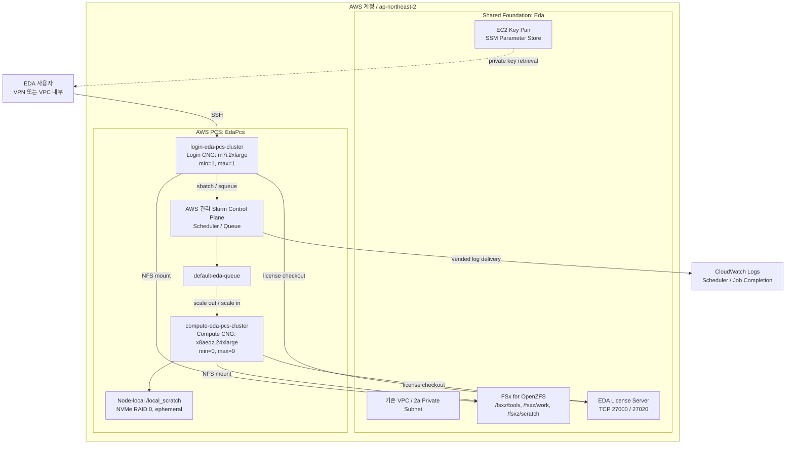

[English](./README.md) | [한국어](./README.ko.md)

# AWS PCS 배포 옵션

이 디렉터리는 기존 AWS ParallelCluster 배포를 변경하지 않고, 동일한 EDA
기반 인프라 위에 AWS Parallel Computing Service(PCS)를 배포하는 독립 경로입니다.

## 빠른 시작

이 절차는 먼저 루트 `setup.sh`로 기존 Shared Foundation을 정상 배포한 환경을
전제로 합니다. PCS는 VPC, subnet, EC2 Key Pair, FSx for OpenZFS/ONTAP, license
server를 새로 만들지 않고, 해당 Foundation을 읽어 재사용합니다.

### 1. Foundation prefix만 맞춥니다

`PCS_SHARED_STACK_PREFIX`에는 이전 `setup.sh` 실행 때 사용한 `STACK_PREFIX`를
넣습니다. 기본 `setup.sh` 설정은 `STACK_PREFIX=Eda`이므로, Foundation stack은
`EdaBase`, `EdaStorage`, `EdaLicenseServer`가 됩니다.

```bash
cp pcs/config/default.env pcs/config/my-pcs.env
```

`pcs/config/my-pcs.env`에서 다음 값만 확인하거나 변경합니다.

```bash
# setup.sh에서 사용한 STACK_PREFIX와 같아야 합니다.
PCS_SHARED_STACK_PREFIX="Eda"

# 필요할 때만 PCS 이름을 변경합니다.
PCS_CLUSTER_NAME="eda-pcs-cluster"
```

Foundation prefix가 기본값 `Eda`이고 기본 PCS profile을 그대로 사용할 경우에는
별도 설정 파일 없이 바로 배포할 수 있습니다. Cluster 이름, AMI, 인스턴스 타입처럼
PCS 전용 값을 변경하려면 아래처럼 `pcs/config/my-pcs.env`를 만들어 사용합니다.

### 설정 파일에서 무엇을 변경하나요?

일반적으로는 `pcs/config/default.env`를 직접 수정하지 않고, 복사한
`pcs/config/my-pcs.env`에서 아래 값만 변경합니다. 변경 후에는 같은
`PCS_CONFIG`를 사용해 `diff`로 확인하고 `deploy`를 다시 실행합니다.

```bash
# Foundation을 재사용하는 환경에서 자주 바꾸는 PCS 전용 값
PCS_SHARED_STACK_PREFIX="Eda"
PCS_CLUSTER_NAME="eda-pcs-cluster"
PCS_AMI_ID="ami-07d7716ef5d114faf"
PCS_LOGIN_INSTANCE_TYPE="m7i.2xlarge"
PCS_COMPUTE_INSTANCE_TYPES="x8aedz.24xlarge"
PCS_COMPUTE_MAX_COUNT=9
PCS_SSH_CIDR="0.0.0.0/0"
```

Foundation 재사용 모드에서는 `PCS_VPC_ID`, `PCS_SUBNET_ID`,
`PCS_OPENZFS_*`, `PCS_LICENSE_*`를 비워 둡니다. PCS setup이 Foundation의
CloudFormation Output에서 값을 자동 해석하므로, 외부 VPC/FSx/license
server를 의도적으로 연결할 때만 해당 값을 직접 입력합니다.

기본 Compute인 `x8aedz.24xlarge`는 서울 리전의 `ap-northeast-2a`에서
사용합니다. 따라서 Foundation을 만들 때 `setup.sh`의 `SUBNET_ID`도 2a private
subnet으로 지정해야 합니다. OpenZFS, PCS Login/Compute Node를 같은 AZ에 배치해
NFS latency와 cross-AZ data transfer를 피하는 것이 EDA workload의 기본입니다.

### 2. PCS를 배포합니다

```bash
# my-pcs.env를 만들었다면
PCS_CONFIG=pcs/config/my-pcs.env ./pcs/pcs-setup.sh deploy

# Eda Foundation과 기본 PCS 설정을 그대로 쓴다면
./pcs/pcs-setup.sh deploy
```

스크립트가 CloudFormation Output/Export에서 VPC, 단일 subnet, Key Pair,
OpenZFS DNS와 보안 그룹, license server 보안 그룹과 포트를 자동으로 찾습니다.
그 다음 PCS Cluster, Login/Compute CNG, Queue, FSx mount lifecycle action,
license server ingress, PCS API endpoint를 배포합니다. 루트 `setup.sh`나
`pcluster` CLI를 다시 실행할 필요가 없으며, 이 명령은 기존 Foundation을
변경하지 않습니다.

이미 배포된 PCS의 설정을 변경할 때는 다음 순서로 진행합니다.

```bash
PCS_CONFIG=pcs/config/my-pcs.env ./pcs/pcs-setup.sh diff
PCS_CONFIG=pcs/config/my-pcs.env ./pcs/pcs-setup.sh deploy
```

### 3. Login Node에 접속하고 첫 job을 실행합니다

아래 명령은 Foundation Key Pair를 SSM Parameter Store에서 받아 현재 실행 중인
PCS Login Node의 private IP로 접속합니다. VPN 또는 VPC 내부에서 실행해야 합니다.

```bash
export AWS_REGION=ap-northeast-2
export PCS_PREFIX=Eda
export PCS_CLUSTER_NAME=eda-pcs-cluster
export SSH_KEY="$HOME/.ssh/pcs-login.pem"

KEY_PAIR_ID=$(aws cloudformation describe-stacks \
  --stack-name "${PCS_PREFIX}Base" \
  --query "Stacks[0].Outputs[?OutputKey=='KeyPairId'].OutputValue" \
  --output text)

aws ssm get-parameter \
  --name "/ec2/keypair/${KEY_PAIR_ID}" \
  --with-decryption \
  --query 'Parameter.Value' \
  --output text > "${SSH_KEY}"
chmod 400 "${SSH_KEY}"

LOGIN_IP=$(aws ec2 describe-instances \
  --filters \
    "Name=tag:Name,Values=login-${PCS_CLUSTER_NAME}" \
    "Name=instance-state-name,Values=running" \
  --query 'Reservations[].Instances[].PrivateIpAddress' \
  --output text)

ssh -i "${SSH_KEY}" ec2-user@"${LOGIN_IP}"
```

Login Node에서는 먼저 storage mount와 scheduler 상태를 확인합니다.

```bash
findmnt -T /fsxz/tools
findmnt -T /fsxz/work
findmnt -T /fsxz/scratch
sinfo
```

`test_job.sh`는 직접 `./test_job.sh`로 실행하지 않고 반드시 `sbatch`로
제출합니다. Slurm 환경 변수와 Compute Node 생성은 batch submission에서만
동작합니다.

```bash
cat > test_job.sh <<'EOF'
#!/bin/bash
#SBATCH --job-name=pcs-storage-test
#SBATCH --partition=default-eda-queue
#SBATCH --cpus-per-task=4
#SBATCH --mem=16G
#SBATCH --time=00:10:00
#SBATCH --output=/fsxz/scratch/pcs-storage-test-%j.out

set -euo pipefail

echo "Job ID: ${SLURM_JOB_ID}"
echo "Node: $(hostname)"
for mount_dir in /fsxz/tools /fsxz/work /fsxz/scratch; do
  findmnt -T "${mount_dir}" >/dev/null
done

probe="/fsxz/scratch/.pcs-storage-test-${SLURM_JOB_ID}"
printf 'PCS storage validation\n' > "${probe}"
test "$(cat "${probe}")" = "PCS storage validation"
rm -f "${probe}"
echo "PCS VALIDATION PASSED"
EOF

JOB_ID=$(sbatch --parsable test_job.sh)
squeue -j "${JOB_ID}"
```

Job이 완료되면 다음 명령으로 결과를 확인합니다.

```bash
cat "/fsxz/scratch/pcs-storage-test-${JOB_ID}.out"
```

## 아키텍처

이 프로젝트에서 `Shared Foundation`은 기존 CDK가 관리하는 공용 인프라 묶음을
뜻할 뿐, AWS PCS의 필수 구성요소는 아닙니다. 기존 인프라를 재사용할 수 있습니다.



- AWS PCS는 Slurm controller와 queue를 관리합니다.
- Login CNG는 사용자가 SSH로 접속해 job을 제출하는 고정 진입점입니다.
- Compute CNG는 Queue의 job 요구량에 따라 0대에서 최대 9대까지 확장됩니다.
- Login/Compute Node는 lifecycle action으로 FSx를 mount하며, License Server에는
  보안 그룹 기반으로 TCP 27000/27020만 접근합니다.

- `{prefix}Base`: 기존 VPC/subnet, KeyPair, 공통 endpoint, FSx 보안 그룹
- `{prefix}Storage`: FSx for OpenZFS
- `{prefix}LicenseServer`: 고정 ENI 기반 EDA 라이선스 서버

PCS 계층은 이 디렉터리의 CDK가 소유합니다.

- `AWS::PCS::Cluster`: AWS 관리 Slurm controller
- `login-<cluster-name>` CNG: `min=1`, `max=1`, queue 미연결
- `compute-<cluster-name>` CNG: 기본 `x8aedz.24xlarge`, `min=0`, `max=9`
- `default-eda-queue`: compute CNG만 연결
- PCS cluster self-reference 보안 그룹
- PCS API Interface VPC Endpoint
- `AWSPCS-*` EC2 role와 instance profile
- EC2 launch templates, IMDSv2, 암호화된 gp3 root volume
- node lifecycle actions: CloudWatch lifecycle 로그와 FSxZ/FSxN mount
- CloudWatch Logs delivery: Scheduler와 Job Completion 로그 기본 활성화
- instance-store를 제공하는 compute type에서 선택 가능한 NVMe RAID 0 `/local_scratch`

FSx mount는 `nodeBootstrapped` 단계에서 실행됩니다. mount 실패 시 노드를
종료하도록 `OnError=TERMINATE`를 사용합니다. 파일시스템 없이 작업을 받는 노드를
정상 상태로 취급하지 않기 위한 운영 안전장치입니다.

PCS는 기존 Foundation을 재사용할 수도, 별도 IaC나 운영팀이 관리하는 VPC/FSx/
license server를 직접 연결할 수도 있습니다. 일반 PCS 배포가 Foundation stack을
생성하거나 변경하지는 않습니다.

기본 `x8aedz.24xlarge`는 node당 96 physical cores, 3 TiB RAM, 7.6 TB local
NVMe를 제공합니다. 기본 최대 node 수 9대는 864 physical cores입니다. Compute
Node의 `nodeBootstrapped` lifecycle action이 두 NVMe SSD를 RAID 0 XFS
`/local_scratch`로 준비합니다. 이 공간은 node 종료 시 사라지므로 compile
scratch나 simulation temporary file에만 사용하고, 결과물은 `/fsxz/work`에
저장합니다.

## AMI 기준

기본값은 서울 리전의 AWS PCS Sample AMI
`ami-07d7716ef5d114faf`입니다. AL2023, x86_64, Slurm 25.11 기반으로 PCS와
Slurm 기능을 검증하는 일반 EDA PoC에 사용할 수 있습니다. EDA Vendor Tool 자체와
고객별 Runtime Library는 포함되지 않으므로 FSx에서 제공하거나 Golden AMI에
추가해야 합니다.

Production 환경에서는 다음을 포함한 검증된 Golden AMI로
`PCS_AMI_ID`를 교체해야 합니다.

- AWS PCS agent
- 선택한 PCS cluster와 호환되는 Slurm 버전
- NFS client
- Amazon CloudWatch agent
- `mdadm`, `xfsprogs`, `util-linux`
- EDA tool runtime, OS libraries, license client 설정
- 인스턴스 유형에 필요한 EFA, GPU 또는 OFED 구성

운영 설정에서는 다음처럼 Sample AMI 허용을 명시적으로 끕니다.

```bash
PCS_ALLOW_SAMPLE_AMI=0
PCS_AMI_ID="ami-<validated-golden-ami>"
```

`PCS_ALLOW_SAMPLE_AMI=0`에서 Sample AMI를 사용하면 preflight가 실패합니다.

## ParallelCluster에서 PCS로 바뀌는 핵심

기존 ParallelCluster 사용자가 운영 방식에서 알아야 할 핵심 차이는 아래와 같습니다.

| 기존 ParallelCluster | PCS 배포 후 |
|---|---|
| Head Node에서 Slurm controller를 직접 운영 | `AWS::PCS::Cluster`가 Slurm controller를 AWS 관리형으로 제공 |
| `pcluster-config.yaml`의 HeadNode/SlurmQueues를 관리 | CDK의 PCS Cluster, Compute Node Group, Queue를 관리 |
| Login Node pool은 ParallelCluster가 관리 | `login-<cluster-name>` CNG가 고정 `min=1`, `max=1`로 유지 |
| Slurm Queue와 EC2 fleet을 `SlurmQueues`에서 정의 | `compute-<cluster-name>` CNG와 `default-eda-queue`가 연결 |
| SharedStorage YAML로 FSx mount | Login/Compute CNG의 `nodeBootstrapped` lifecycle action이 `/fsxz/*` mount |
| Cluster node SG에서 license server를 연결 | PCS Cluster SG가 license server SG의 TCP 27000/27020 source로 추가 |
| head node의 로그를 확인 | Scheduler/Job Completion 로그를 CloudWatch Logs로 확인 |

사용자 관점에서는 Login Node에 SSH한 뒤 `sbatch`, `squeue`, `sinfo`를 쓰는
방식은 그대로입니다. 달라지는 점은 Slurm controller와 compute fleet의 수명주기를
AWS PCS가 관리한다는 것입니다. Queue 이름은 기존 ParallelCluster의
`eda-x8aedz`가 아니라 기본 `default-eda-queue`입니다.

## 설정

일반 PCS `synth`, `diff`, `deploy`, `destroy`는 루트 `CONFIG`를 읽지 않습니다.
`pcs/config/default.env` 또는 `PCS_CONFIG`만 사용합니다. 기존 Foundation을 생성하거나
변경하는 `foundation-*` 명령에서만 루트 `CONFIG`를 사용합니다.

```bash
cp pcs/config/default.env pcs/config/eda-poc.local.env
```

기본 배포는 별도 설정이 필요 없습니다. 정상 배포된 `Eda` Shared Foundation이 있으면
다음 한 줄로 Foundation의 VPC, subnet, Key Pair, FSx, license server 정보를
자동으로 재사용합니다.

```bash
./pcs/pcs-setup.sh deploy
```

`PCS_SHARED_STACK_PREFIX=Eda`가 기본값입니다. 기존 Foundation의
`EdaBase`, `EdaStorage`, `EdaLicenseServer`가 게시한 CloudFormation Output
Export에서 VPC, subnet, FSx, Key Pair, 라이선스 서버를 **읽어 재사용**할 뿐, 일반 PCS
명령이 Foundation stack을 배포하거나 변경하지는 않습니다. 기존처럼 Export가 없는
Foundation은 Output 조회 fallback을 사용합니다. AWS PCS Cluster control plane,
Login CNG, Compute CNG와 PCS API Endpoint는 모두 `PCS_SUBNET_ID` 하나를 사용합니다.
`PCS_CONFIG`는 cluster 이름, Golden AMI, 인스턴스 타입처럼 PCS 전용 값을 바꿀 때만
만들면 됩니다.

Foundation 없이 PCS만 배포하려면 `PCS_SHARED_STACK_PREFIX=""`로 두고, 활성화한
기능의 직접 값을 모두 제공합니다.

```bash
PCS_SHARED_STACK_PREFIX=""
PCS_VPC_ID="vpc-0123456789abcdef0"
PCS_SUBNET_ID="subnet-0123456789abcdef0"
PCS_KEY_PAIR_NAME="eda-pcs-key"
PCS_OPENZFS_DNS="fs-0123456789abcdef0.fsx.ap-northeast-2.amazonaws.com"
PCS_OPENZFS_SECURITY_GROUP_ID="sg-0123456789abcdef0"
PCS_ENABLE_LICENSE_ACCESS=1
PCS_LICENSE_SECURITY_GROUP_ID="sg-1123456789abcdef0"
PCS_LICENSE_MANAGER_PORT=27000
PCS_LICENSE_VENDOR_PORT=27020
```

라이선스 서버가 없는 기능 검증이면 `PCS_ENABLE_LICENSE_ACCESS=0`으로 끌 수
있습니다. SSH를 쓰지 않을 경우 `PCS_SSH_CIDR=""`로 두면 Key Pair도 필요하지
않습니다.

주요 옵션:

| 변수 | 기본값 | 설명 |
|---|---|---|
| `PCS_REGION` | `ap-northeast-2` | PCS 배포 리전 |
| `PCS_VPC_ID` | 빈 값 | 비어 있으면 Foundation VPC 자동 조회, 값이 있으면 override |
| `PCS_SUBNET_ID` | 빈 값 | 비어 있으면 Foundation subnet 자동 조회, 값이 있으면 override |
| `PCS_SHARED_STACK_PREFIX` | `Eda` | 기본 Foundation CloudFormation Output Export prefix. 빈 값이면 direct input 모드 |
| `PCS_CLUSTER_NAME` | `eda-pcs-cluster` | PCS Cluster 이름. 최대 17자이며 CNG/EC2 이름은 `login-<name>`, `compute-<name>` |
| `PCS_AMI_ID` | `ami-07d7716ef5d114faf` | 서울 리전 AL2023/x86_64/Slurm 25.11 Sample AMI |
| `PCS_SLURM_VERSION` | `25.11` | 신규 PCS cluster용 Slurm |
| `PCS_CLUSTER_SIZE` | `SMALL` | 최대 32 nodes / 256 jobs |
| `PCS_LOGIN_INSTANCE_TYPE` | `m7i.2xlarge` | 로그인 CNG |
| `PCS_COMPUTE_INSTANCE_TYPES` | `x8aedz.24xlarge` | 2a Foundation용 compute CNG 허용 유형 |
| `PCS_COMPUTE_MAX_COUNT` | `9` | 최대 864 physical-core compute 노드 수 |
| `PCS_QUEUE_NAME` | `default-eda-queue` | Compute CNG가 연결되는 기본 Slurm Queue/Partition |
| `PCS_PURCHASE_OPTION` | `ONDEMAND` | `ONDEMAND` 또는 `SPOT` |
| `PCS_SSH_CIDR` | `0.0.0.0/0` | Private Subnet/VPN 전제의 Login Node SSH 허용망 |
| `PCS_ENABLE_SSM` | `0` | 기본 Foundation에 SSM endpoint가 없으므로 기본 비활성화 |
| `PCS_KEY_PAIR_NAME` | 빈 값 | standalone SSH용 EC2 Key Pair. prefix가 있으면 Foundation Key Pair fallback |
| `PCS_ENABLE_LICENSE_ACCESS` | `1` | license SG ingress rule 생성 여부 |
| `PCS_LICENSE_*` | 빈 값 | standalone license SG, manager port, vendor port |
| `PCS_ENABLE_ACCOUNTING` | `0` | `1`일 때만 PCS STANDARD Accounting 활성화 |
| `PCS_ENABLE_OPENZFS_MOUNTS` | `1` | `/fsxz/tools`, `/fsxz/work`, `/fsxz/scratch` |
| `PCS_OPENZFS_DNS` | 빈 값 | 외부 FSxZ DNS, 빈 값이면 Foundation Output Export 사용 |
| `PCS_OPENZFS_SECURITY_GROUP_ID` | 빈 값 | DNS 입력 시 ENI에서 자동 검색, DNS도 비면 Foundation Output Export 사용 |
| `PCS_ENABLE_ONTAP_MOUNTS` | `0` | `/fsxn/tools`, `/fsxn/work`, `/fsxn/scratch` |
| `PCS_ONTAP_SVM_NFS_DNS` | 빈 값 | 외부 ONTAP SVM NFS DNS |
| `PCS_ONTAP_SECURITY_GROUP_ID` | 빈 값 | DNS 입력 시 ENI에서 자동 검색 |
| `PCS_ENABLE_LOCAL_SCRATCH` | `1` | x8aedz local NVMe RAID 0 `/local_scratch` |
| `PCS_CREATE_PCS_VPC_ENDPOINT` | `1` | private PCS API 연결 |
| `PCS_FOUNDATION_SCOPE` | `base` | foundation 명령 대상: `base` 또는 `all` |

예를 들어 `PCS_CLUSTER_NAME=chip-poc`이면 PCS Cluster는 `chip-poc`,
Login CNG와 EC2 `Name` 태그는 `login-chip-poc`, Compute CNG와 EC2
`Name` 태그는 `compute-chip-poc`이 됩니다. 관련 리소스에는
`Project`, `DeploymentModel`, `ClusterName` 태그도 적용됩니다.

외부 FSx DNS만 입력하고 SG를 비워 두면 `pcs-setup.sh`가 DNS에서 File System ID를
추출하고 FSx Network Interface에 연결된 SG를 조회합니다. 연결된 SG가 정확히
하나면 자동으로 사용합니다. 여러 개면 임의 선택하지 않고 배포를 중단하므로
`PCS_*_SECURITY_GROUP_ID`를 명시해야 합니다. DNS와 SG를 모두 비워 두면
`{prefix}Storage`와 `{prefix}Base`가 게시한 CloudFormation Output Export를
사용합니다.

```bash
PCS_ENABLE_OPENZFS_MOUNTS=1
PCS_OPENZFS_DNS="fs-0123456789abcdef0.fsx.ap-northeast-2.amazonaws.com"
# SG가 하나만 연결되어 있으면 자동 검색
PCS_OPENZFS_SECURITY_GROUP_ID=""

PCS_ENABLE_ONTAP_MOUNTS=1
PCS_ONTAP_SVM_NFS_DNS="svm-0123456789abcdef0.fs-1123456789abcdef0.fsx.ap-northeast-2.amazonaws.com"
PCS_ONTAP_SECURITY_GROUP_ID=""
```

`PCS_SSH_CIDR=0.0.0.0/0`은 Login Node가 Public IP 없이 Private Subnet에 있고
VPC/VPN 경로로만 접근한다는 이 프로젝트의 전제를 따릅니다. Public Subnet이나
인터넷 경로를 사용하는 환경에서는 반드시 사내 또는 VPN CIDR로 제한해야 합니다.
Prefix 없이 SSH를 활성화하면 `PCS_KEY_PAIR_NAME`을 반드시 지정해야 합니다.
기본 Foundation에는 SSM Interface Endpoint가 없으므로 `PCS_ENABLE_SSM=0`이
기본값입니다. SSM을 사용할 때만 endpoint 또는 서비스 egress를 먼저 준비한 뒤 `1`로
바꿉니다.

## PCS Scheduler Log delivery

`PCS_ENABLE_CLOUDWATCH_LIFECYCLE_LOGS`는 Login/Compute Node의 lifecycle
action 로그를 CloudWatch로 보내기 위한 설정입니다. 아래 PCS Log delivery와는
별도 기능입니다. PCS Log delivery는 AWS 관리 Slurm control plane 로그를
CloudWatch Logs로 내보냅니다.

| 변수 | 기본값 | CloudWatch Log Group | 용도 |
|---|---:|---|---|
| `PCS_ENABLE_SCHEDULER_LOG_DELIVERY` | `1` | `/aws/pcs/<cluster>/scheduler` | scheduler의 운영 및 장애 로그 |
| `PCS_ENABLE_JOB_COMPLETION_LOG_DELIVERY` | `1` | `/aws/pcs/<cluster>/job-completion` | 종료 job 상태, 요청/할당 리소스, 종료 상세 |
| `PCS_ENABLE_SCHEDULER_AUDIT_LOG_DELIVERY` | `0` | `/aws/pcs/<cluster>/scheduler-audit` | compliance 또는 집중 조사 때 사용하는 Slurm RPC audit 로그 |
| `PCS_LOG_RETENTION_DAYS` | `30` | 위 세 Log Group 공통 | CloudWatch Logs 보존 기간 |

기본 profile은 운영 가시성을 위해 Scheduler와 Job Completion 로그를 켭니다.
Slurm `25.11`의 Scheduler Audit 로그는 scheduler log volume의 최대 90%까지
증가할 수 있으므로, 기본값은 비활성화합니다. Compliance 요구나 특정 조사 기간에만
Audit을 별도 활성화하는 것이 EDA PoC와 일상 운영에 알맞습니다.

이 변경은 Log delivery 리소스만 추가하거나 제거하며 PCS Cluster나 Compute Node
Group을 교체하지 않습니다. `./pcs/pcs-setup.sh diff`로 먼저 확인하고
`./pcs/pcs-setup.sh deploy`로 적용합니다.

Lifecycle Action 변경은 새로 생성되거나 재부팅되는 노드에 적용됩니다. Compute
Node는 다음 scale-out부터 새 설정을 사용합니다. 계속 실행 중인 Login Node에는
즉시 스크립트가 실행되지 않으므로, 변경 검증 후 Login Node를 재부팅하거나
교체해야 합니다. Mount Action은 `EVERY_BOOT`,
`ScriptCachingPolicy=REFRESH_ON_REBOOT`로 구성됩니다.

## Shared foundation 안전 배포

일반 `synth`, `diff`, `deploy`, `destroy`는 기존 Base, Storage,
LicenseServer stack을 변경하지 않습니다.

기존 환경에 PCS용 CloudFormation Export만 추가할 때는 Base stack만 확인하고
배포합니다.

```bash
CONFIG=config/eda-poc.local.env \
PCS_CONFIG=pcs/config/eda-poc.local.env \
PCS_FOUNDATION_SCOPE=base \
./pcs/pcs-setup.sh foundation-diff

CONFIG=config/eda-poc.local.env \
PCS_CONFIG=pcs/config/eda-poc.local.env \
PCS_FOUNDATION_SCOPE=base \
./pcs/pcs-setup.sh foundation-deploy
```

새 Foundation은 기존 루트 `config/default.env` 또는 사용자의 기존
`CONFIG`로 `setup.sh`에서 생성합니다. Foundation 생성 설정과 PCS 설정을 한
파일에 섞지 않습니다. PCS 전용 변경은 `pcs/config/default.env`를 복사한
`PCS_CONFIG`에서만 관리합니다.

## PCS 실행

```bash
# CloudFormation 합성만 수행
PCS_CONFIG=pcs/config/eda-poc.local.env \
./pcs/pcs-setup.sh synth

# 실제 AWS 상태와 변경점 확인
PCS_CONFIG=pcs/config/eda-poc.local.env \
./pcs/pcs-setup.sh diff

# PCS stack만 배포
PCS_CONFIG=pcs/config/eda-poc.local.env \
./pcs/pcs-setup.sh deploy
```

PoC 종료 시 PCS stack만 삭제합니다. Shared FSx와 license server는 별도
foundation 수명주기로 유지됩니다.

```bash
PCS_CONFIG=pcs/config/eda-poc.local.env \
./pcs/pcs-setup.sh destroy
```

## Preflight 검증

배포 전 다음을 read-only API로 확인합니다.

- 서울 리전의 PCS API 사용 가능 여부
- 모든 subnet이 같은 VPC에 있는지
- VPC DNS support/hostname과 default tenancy
- AMI 상태, x86_64 architecture, root device, Slurm 버전
- sample AMI production 차단
- 인스턴스 유형의 대상 AZ 제공 여부
- instance-store 지원과 최대 node 수 기준 physical-core 목표
- private subnet에서 S3 lifecycle asset 접근 가능 여부
- SSM 사용 시 SSM endpoint 또는 서비스 egress
- FSx DNS가 가리키는 파일시스템 종류와 VPC
- Storage Security Group이 PCS VPC에 속하는지
- 명시적 FSx 값이 없을 때 필요한 Foundation CloudFormation Output/Export

## 전환 전략

1. 기존 ParallelCluster를 유지한 채 별도 이름의 PCS cluster를 배포합니다.
2. 동일한 OpenZFS와 라이선스 서버를 연결합니다.
3. 대표 EDA job으로 성능, 라이선스 checkout, UID/GID, 파일 잠금, 로그를 비교합니다.
4. queue별 동시 실행으로 결과 일치와 운영 절차를 검증합니다.
5. 제출 경로를 PCS login node로 전환합니다.
6. 안정화 기간 후에만 ParallelCluster를 제거합니다.

클러스터 control plane을 in-place 변환하지 않는 것이 핵심입니다. PCS와
ParallelCluster는 서로 다른 수명주기와 장애 도메인으로 운영합니다.

## 검증 명령

```bash
cd pcs
.venv/bin/python -m pytest -q
.venv/bin/ruff check app.py pcs scripts tests

AWS_REGION=ap-northeast-2 \
CDK_DEFAULT_ACCOUNT=111111111111 \
./node_modules/.bin/cdk synth \
  -c pcs:vpc_id=vpc-0123456789abcdef0 \
  -c pcs:subnet_id=subnet-0123456789abcdef0 \
  -c pcs:ami_id=ami-0123456789abcdef0
```

## 공식 참조

- AWS PCS User Guide: https://docs.aws.amazon.com/pcs/latest/userguide/
- PCS CloudFormation resources: https://docs.aws.amazon.com/AWSCloudFormation/latest/UserGuide/AWS_PCS.html
- PCS AMI installers: https://docs.aws.amazon.com/pcs/latest/userguide/working-with_ami_installers.html
- PCS PrivateLink: https://docs.aws.amazon.com/pcs/latest/userguide/vpc-interface-endpoints.html
